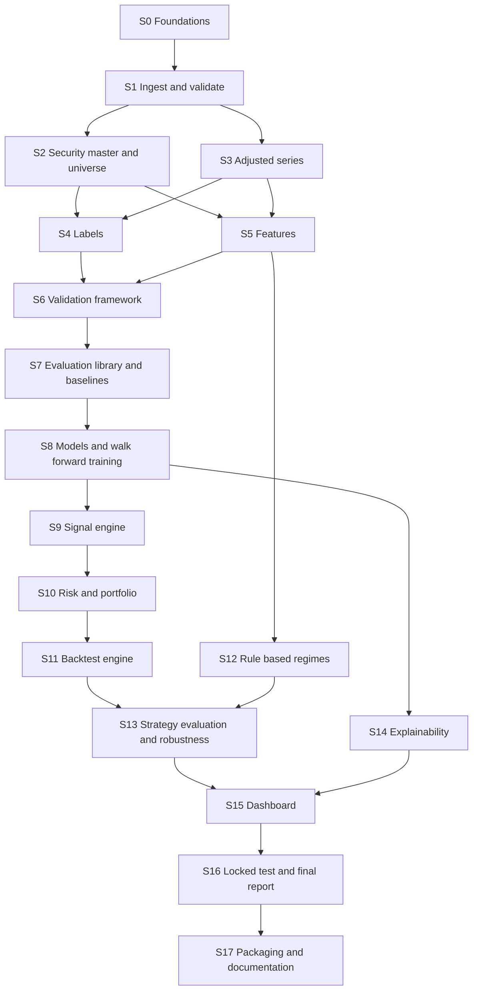

# Master Project Build Guide
## AI-Driven Equity Research & Portfolio Decision Support System

**Document status:** v1.1 (consolidated) · written 30 Sep 2026 · single source of truth for implementation
**Dataset frozen at:** `NASDAQ100_Historical_Data.csv` (inside `archive.zip`) · 514,075 rows · 2000-01-03 → 2026-02-18
**Code language / package:** Python 3.11+ · importable package `nasdaq100` under `src/`
**Working environment:** a local laptop (CPU only), a Python virtual environment, a terminal, a code editor, and one Claude chat per stage (details in §0.4)

## Contents

- **Part 0: How to use this document** (0.1 purpose · 0.2 organisation · 0.3 Claude session protocol and prompt templates · **0.4 tools, environments and execution workflow**)
- **Part I: Project briefing** (I.1 goal · I.2 concept primer · I.3 verified dataset facts · I.4 principles · I.5 frozen decisions D1–D20 · I.6 corrections C1–C14 · I.7 open questions Q1–Q10 · I.8 scope tiers · I.9 roadmap, milestones and stage-to-tool summary)
- **Part II: Global specifications** (II.1 conventions · II.2 time convention · II.3 repository layout · II.4 configuration · II.5 artifact schemas · II.6 registry and project state · II.7 testing · II.8 logging, errors, CLI and make targets · II.9 dependencies)
- **Part III: Build stages** S0 Foundations · S1 Ingestion and validation · S2 Security master and universe · S3 Adjusted series · S4 Labels · S5 Features · S6 Validation framework · S7 Evaluation library and baselines · S8 Models, tuning, calibration, walk-forward · S9 Signal engine · S10 Risk and portfolio · S11 Backtest engine · S12 Regimes · S13 Evaluation and robustness · S14 Explainability · S15 Dashboard · S16 Locked test and final report · S17 Packaging
- **Part IV: Scope tiers, policies and reference** (IV.1 Advanced A1–A13 (A8 promoted to the MVP) · IV.2 Experimental E1–E10 · IV.3 Deferred/excluded · IV.4 claims policy · IV.5 leakage-test catalogue L1–L18 · IV.6 failure-mode map · IV.7 acceptance checklist · IV.8 glossary and formulas)

---

# PART 0: HOW TO USE THIS DOCUMENT

## 0.1 What this document is

This guide turns the project from an empty repository into a finished, tested, reproducible research system. It is written for two readers:

1. **You (the student/builder).** Each stage explains *what* is being built, *why*, and *what concepts you need* in plain language, alongside the precise specification.
2. **A future Claude coding session** that has never seen the earlier research conversation. Everything Claude needs (decisions, schemas, formulas, defaults, tests, definitions of done) is inside this document. **Where this guide is silent, do not invent architecture; choose the simplest option consistent with Part I's decisions and record the choice in `docs/decisions/` (see §0.3).**

The earlier *Research & Architecture Report* is background only. **If it differs from this guide, this guide wins.** Every difference is listed in §I.6 ("Corrections") with its reason.

## 0.2 How the guide is organised

| Part | Content | When to read |
|---|---|---|
| **Part 0** | Usage, session protocol, prompt templates, **tools/environments/execution workflow (§0.4)** | Always first |
| **Part I** | Project briefing: goal, concepts, dataset facts, frozen decisions, corrections, open questions, roadmap | Always (context for every stage) |
| **Part II** | Global specifications: conventions, time convention, repository layout, artifact schemas, configuration, testing rules | Always (interfaces between stages) |
| **Part III** | **Build stages S0–S17**, in order, each with purpose, prerequisites, files, inputs/outputs, specification, tests, definition of done, pitfalls | Read the stage you are implementing, plus its prerequisites' Output sections |
| **Part IV** | Advanced and experimental tracks, deferred/excluded items, claims policy, leakage-test catalogue, failure-mode map, acceptance checklist, glossary | Reference |

Every stage in Part III ends its header material with a **Tooling and workflow** block stating which workspace (Claude chat, editor, terminal, notebook, browser, Git) each action happens in and which terminal commands to run. The workspaces and the standard stage loop are defined once in §0.4.

## 0.3 Session protocol for a future Claude conversation

When a coding session starts, Claude should:

1. **Read Part 0, Part I and Part II fully**, then read the requested stage in Part III and the *Outputs* sections of every stage listed under its "Depends on".
2. **Inspect the attached project files.** Read `PROJECT_STATE.md` (repo root) first. It records which stages are complete, which artifacts exist, and any deviations. If the files contradict the guide, report the contradiction before coding.
3. **Check prerequisites.** If a required artifact from an earlier stage is missing (for example `labels.parquet` for Stage S6), say so and stop, rather than fabricating substitute data.
4. **Implement exactly the requested stage.** Produce, in this order: (a) the code files listed under "Files"; (b) the tests listed under "Tests"; (c) any config additions to `configs/base.yaml`; (d) doc updates; (e) an updated `PROJECT_STATE.md` entry; (f) a short "How to verify" list of commands and expected outcomes matching the stage's Definition of Done, stating for each action **which workspace (W1–W7, §0.4) it happens in** and giving the exact terminal commands.
5. **Respect frozen decisions (D-numbers in §I.5).** Never change them silently. If Claude believes a decision is technically wrong, it must say so explicitly, explain the evidence, propose a correction, and wait for approval, and it must not implement the change on its own.
6. **Never look at the locked test period** (dates ≥ 2020-01-02) except in Stage S16, and only through the guard described in Stage S6.
7. **Coding standards (all stages):** type hints on all public functions; docstrings that state inputs, outputs, and time semantics ("uses data ≤ t only"); pure functions where specified; no hard-coded parameters (read from config); no global mutable state; deterministic behaviour (seeded); `pathlib` for paths; logging via the project logger (never bare `print` in library code); vectorised pandas/NumPy over Python row loops except in the backtest day-loop; fail loudly with informative errors rather than silently continuing.
8. **Decision records.** Any judgement call not covered here is written as a short file `docs/decisions/NNNN-title.md` (context, decision, alternatives, consequences).
9. **Environment awareness.** Claude cannot run code on the user's machine. Every command it tells the user to run must be something that can be pasted into the terminal (W3) in the repository root with the virtual environment active; the CLI (`python -m nasdaq100.cli …`) is canonical and `make` targets are optional wrappers (§0.4.2, §II.8). Claude must not put pipeline logic in notebooks.

### Prompt templates for future sessions

*Implement a stage:*
> "Attached: Master Project Build Guide, `PROJECT_STATE.md`, the repo tree, and the files listed in §0.4.6 for this stage. Implement **Stage S__** exactly as specified. Follow Part 0 §0.3. Output the code, tests, config changes, doc updates, `PROJECT_STATE.md` entry, and a verification checklist that says which workspace each step happens in and gives the terminal commands."

*Review a stage:*
> "Attached: the Guide and the code for **Stage S__**. Audit it against the stage's Specification, Tests and Definition of Done. List every deviation, bug, and leakage risk, ranked by severity, with fixes. Do not rewrite unrelated files."

*Debug:*
> "Attached: the Guide, the failing test/traceback, and relevant files. Identify the root cause with reference to the Guide's contracts (Part II schemas, time convention). Propose the minimal fix."

## 0.4 Tools, environments and execution workflow

This section answers, once and for all, *"what tool am I supposed to be in right now?"* Each stage in Part III repeats the specifics in a **Tooling and workflow** block, using the workspace names defined here. **The project's architecture does not depend on any particular editor or vendor; the choices below are the ones the architecture calls for (a local, file-based, CPU-only Python project) and are tool-agnostic where noted.**

### 0.4.1 The workspaces (W1–W7)

| ID | Workspace | What happens here | Status |
|---|---|---|---|
| **W1** | **Claude chat session** (a fresh conversation per stage) | Claude reads this guide plus the files you attach, and **writes** source code, tests, config and docs for one stage; also reviews and debugs. Claude cannot see or run anything on your computer: you move text between W1 and your machine | **Required** (this is how the code gets written) |
| **W2** | **Code editor / IDE** (any editor with Python support and an integrated terminal; VS Code and PyCharm are both fine; this guide does not prescribe one) | Holds the repository. Everything that *is* the project lives here as files: `src/`, `tests/`, `configs/`, `dashboard/`, `docs/`, `data/reference/`. You paste Claude's output into files here, read diffs, edit YAML, read reports | **Required** (any editor) |
| **W3** | **Terminal** opened in the repository root **with the project's virtual environment activated** | *Everything is executed here*: installing packages, the pipeline commands (`python -m nasdaq100.cli …` or `make …`), `pytest`, `ruff`, training, backtesting, `streamlit run`, `git`, `docker`. Long jobs (walk-forward training, robustness suite) run here and log to `artifacts/logs/` | **Required** |
| **W4** | **Git (local) + GitHub (remote, with Actions for CI)** | Version control and history. Commit at the end of every stage; tag milestones M1–M4 and `pre-locked-test`. GitHub Actions runs the lint and test suite automatically | Git **required**; GitHub **recommended** (portfolio visibility, CI) |
| **W5** | **Notebook environment** (Jupyter Lab, or notebook support inside your editor) | *Looking at things*: plot a distribution, eyeball flagged rows, sanity-check a feature. Notebooks **read artifacts** and may call package functions, but **never hold pipeline logic, never write to `data/processed` or `artifacts`, and are never imported by `src/`** | **Optional** |
| **W6** | **Web browser** | The Streamlit dashboard (opens on a local address such as `localhost:8501` when launched from W3), rendered reports, GitHub CI results | **Required** from S15 onward (for the dashboard) |
| **W7** | **Docker** | Builds/runs the packaged application in S17 | **Recommended at S17 only** (the Dockerfile is an S17 deliverable; Docker is not needed for development) |

**Not needed at any stage:** GPU or cloud compute (everything is CPU-only and runs on an ordinary laptop: ~0.5 M rows, LightGBM and linear models), database servers, workflow orchestrators, a separate experiment-tracking server. (MLflow and an API service are Advanced items only, §IV.1 A10.)

### 0.4.2 Golden rules (they prevent most workflow mistakes)

1. **Source code is the single home of logic.** Any computation that matters lives in `src/nasdaq100/` (W2), is run from the terminal (W3), and is covered by tests. A notebook cell is never the only place a result is produced.
2. **Anything that creates an artifact runs from the terminal through the CLI** (`python -m nasdaq100.cli <command>`). This is what guarantees seeding, config hashing, logging and registry rows. Notebooks and the dashboard only *read* artifacts.
3. **The CLI is canonical; `make` is a convenience.** Every `make` target is just a short list of CLI commands (table in §II.8). If `make` is unavailable (for example on Windows without it), run the CLI commands directly. Nothing in the project requires `make`.
4. **Experiments are configuration, not code changes.** Variants (stride, calibration method, feature switches, cost sweeps) are run by passing an override YAML from `configs/experiments/` or `--override key=value` in the terminal (W3), never by editing `base.yaml` ad hoc.
5. **Insights from notebooks become durable artifacts:** a new test, a config default, a line in `docs/`, or a decision record in `docs/decisions/`. Otherwise they are lost.
6. **One stage = one fresh Claude chat = one commit** (W1 → W2 → W3 → W4). Progress is carried by `PROJECT_STATE.md` and the repository, not by chat history.
7. **The dataset never goes into Git** (`data/raw/` is ignored). You place `archive.zip` there once; its hash is recorded in `MANIFEST.json`.
8. **The locked test period is never opened outside S16** (W3 only, through the guard), and not in notebooks either.

### 0.4.3 The standard stage loop (how you move between workspaces)

Every stage follows the same loop. Stage-specific commands are in each stage's *Tooling and workflow* block.

| Step | Workspace | Action | Move on when |
|---|---|---|---|
| 1 | **W3 → W4** | Make sure the working tree is clean and the previous stage is committed. Optionally create a branch `stage/S__-name` | `git status` clean |
| 2 | **W1** | Open a **new chat**. Attach: this guide; `PROJECT_STATE.md`; a listing of the repo tree; `configs/base.yaml`; the source files of the modules the stage depends on (at least their public interfaces); a *small* data sample only when the stage needs to see real data (e.g. the first 20 lines of the CSV for S1). Send the "Implement a stage" prompt (§0.3) | Claude returns code, tests, config changes, docs and a verification checklist |
| 3 | **W1 → W2** | Save each returned file at the path Claude names; review with `git diff`; edit YAML/config in the editor | All files saved; no syntax errors shown by the editor |
| 4 | **W2 → W3** | Run the fast tests: `pytest -m "not needs_data and not slow"`, and `ruff` | Green. If red: copy the failing output back to **W1** using the *Debug* prompt, apply the fix in W2, repeat |
| 5 | **W3** | Run the stage's pipeline command(s) on the **real data** (and `pytest -m needs_data`), then compare against the stage's Definition of Done numbers | Outputs exist, checks match the DoD |
| 6 | **W5 (optional) / W6 / W2** | *Look* at the results: read the generated report in the editor, plot in a notebook if helpful, or view the dashboard once it exists | Results are sensible, or you have logged an issue |
| 7 | **W2** | Update `PROJECT_STATE.md` (Claude drafts it in step 2), docs, and a decision record if any judgement call was made | Stage checklist ticked |
| 8 | **W3 → W4** | `git add`, `git commit -m "S__: <stage name>"`, push (CI runs in GitHub). Tag at milestones: `M1` after S5, `M2` after S8, `M3` after S13, `pre-locked-test` and `M4` in S16 | CI green; then start the next stage in a new W1 chat |

**Hand-off triggers** (when to switch tools):
- *W1 → W2:* as soon as Claude has produced code. *W2 → W3:* whenever you want to know whether it works. *W3 → W1:* on any failing test, traceback or surprising number (paste the exact output). *W3 → W5:* only to *inspect* an artifact. *W5 → W2:* when a notebook finding should become a test, config value or doc. *W3 → W6:* at S15 when launching the dashboard. *W3 → W4:* at the end of every stage.

### 0.4.4 Where each kind of work happens

| Kind of work | Where and how | Notes |
|---|---|---|
| Writing/changing project code | Generated in **W1**, stored and edited in **W2** (`src/`) | The repository is the source of truth |
| Data acquisition | Manual copy of `archive.zip` into `data/raw/` (file manager or **W3**) | Never committed; hash-checked on ingest |
| Data pipeline and feature building | **W3**, CLI commands `ingest … build-features` | Deterministic, re-runnable from raw |
| **Experimentation** (model/feature/stride/calibration variants, ablations) | **W3**, CLI with `configs/experiments/*.yaml` overrides or `--override`; results land in `artifacts/runs/` and `experiments/registry.csv` | Every run registered; dev trials counted for DSR |
| **Training** (tuning, walk-forward) | **W3** CLI: `tune`, `walkforward` | CPU; minutes to tens of minutes; logs in `artifacts/logs/` |
| **Testing** | **W3** `pytest` with markers; **W4** GitHub Actions runs the subset without the real dataset | Leakage tests (§IV.5) are first-class |
| **Backtesting** | **W3** CLI `backtest`, `evaluate` | Same engine for strategy, baselines and benchmark |
| Ad hoc analysis / exploratory plots | **W5** (optional) reading artifacts | Not a place for logic |
| **Formal visualization** | **W6** Streamlit dashboard (Plotly charts) and static figures generated into `reports/` by the `evaluate`/`explain` commands | Dashboard only reads artifacts |
| Dashboard development | Edit in **W2**, run `streamlit run dashboard/app.py` (or `make app`) in **W3**, view in **W6** | Streamlit auto-reloads on file save |
| Experiment tracking | `experiments/registry.csv` (append-only; view in W2/W5/dashboard) | MLflow is Advanced/optional |
| Documentation | **W2** (Markdown in `docs/`, `README.md`) | Claude drafts, you review |
| Packaging/reproducibility check | **W3** (fresh clone, fresh virtual environment; optionally **W7** Docker) | S17 |

### 0.4.5 Initial environment setup (done once, in S0)

Performed in **W3** from the project root. These are environment steps, not project code:
1. Confirm Python 3.11 or newer is installed.
2. Create a virtual environment inside the project (`python -m venv .venv`) and **activate it** (macOS/Linux: `source .venv/bin/activate`; Windows PowerShell: `.venv\Scripts\Activate.ps1`). Your editor (W2) must be pointed at this same interpreter.
3. Install the project in editable mode with the development extras (`pip install -e ".[dev]"`). Optional notebook extras (`jupyterlab`, `ipykernel`) are installed only if you want W5.
4. Verify: `pytest` runs, `python -m nasdaq100.cli status` prints the project checklist.
5. `git init`, first commit; create the GitHub repository and push (recommended); confirm the CI workflow passes.

**Hardware expectation:** a laptop with ~8 GB RAM is sufficient; no GPU.

### 0.4.6 What to attach to each Claude session

| Situation | Attach to the W1 chat |
|---|---|
| Any stage | This guide; `PROJECT_STATE.md`; repo tree listing; `configs/base.yaml` |
| Stage uses earlier code | The source files (or at least public function signatures and docstrings) of the modules the stage *depends on* (see "Depends on") |
| S1 only | The first ~20 lines of `NASDAQ100_Historical_Data.csv` (the verified dataset facts are already in §I.3; Claude does not need the 27 MB file) |
| Later stages | Not the dataset. Claude works from the schemas in §II.5. Attach only `head` samples of the relevant artifacts (exported as CSV) if debugging requires real values |
| Review/debug | The failing test output or traceback, the files involved, and the stage's Specification |

---

# PART I: PROJECT BRIEFING

## I.1 What we are building

A **research-grade decision-support platform for large-cap Nasdaq stocks**. For every trading day and every eligible stock it estimates how the stock is likely to perform **relative to its peers over the next 20 trading days**, converts those estimates into transparent BUY / HOLD / SELL signals through an explicit rulebook, applies a small risk layer, builds a simple top-N portfolio, and evaluates all of it in a realistic, cost-aware, leakage-controlled backtest. A Streamlit dashboard presents the results, the explanations, and the limitations.

**What it is not:** a trading bot, a price predictor, or a claim of beating the market. The scientific product is the *evaluation methodology and its honesty*. A negative result ("the ML model does not reliably beat simple baselines here") is a valid, publishable-quality outcome, and the system is built to expose it, not hide it.

## I.2 Concept primer (plain language; read once)

| Concept | What it means here |
|---|---|
| **Return / log return** | Percentage gain over a period. We use *log returns*, `ln(P_end / P_start)`. They add across time, and small values ≈ percentage returns. |
| **Split adjustment** | When a company does a 2-for-1 split, its price halves, but nothing economic happened. Data providers rewrite history so prices are comparable. |
| **Dividend adjustment** | Extra rewriting so that price changes include dividends (as if reinvested). `Adj Close` has both split and dividend adjustment; `Close` in this dataset has splits only. **All returns in this project come from `Adj Close`.** |
| **Excess return** | A stock's return minus the average return of its peers over the same window. Removes the "everything went up/down together" component, which is hard to predict and is not what a stock-picking tool should try to predict. |
| **Cross-sectional** | Comparing many stocks *on the same date* (ranking them), versus *time-series* (one stock through time). Our model ranks stocks each day. |
| **Rank IC (information coefficient)** | For one date: the Spearman rank correlation between predicted scores and realised future excess returns across stocks. The main measure of whether the model ranks well. ~0.02–0.05 is "good" in real equity research; noise alone gives about ±1/√(number of stocks) ≈ ±0.13 per date. |
| **Feature / label** | Feature = information known at decision time (e.g. past momentum). Label = the future outcome we want to predict (20-day-ahead excess return). |
| **Look-ahead bias / leakage** | Any way future information sneaks into a feature, model, threshold, or evaluation. It produces backtests that look great and fail in reality. Most of this guide's structure exists to prevent it. |
| **Walk-forward validation** | Train on the past, test on the next block, roll forward. Never random shuffling. |
| **Purge / embargo / gap** | Labels look 20 days ahead, so a training row from 10 days before the test start "knows" what happens in the test period. We drop such rows (purge) plus a small safety buffer (embargo). |
| **Locked test** | A final period (2020-01-02 onward) no one may look at while designing. It is opened once, to confirm rather than to tune. |
| **Calibration** | Making a predicted probability honest: of all cases where the model says "60%", about 60% should really happen. |
| **Signal vs model** | The model estimates; the signal engine applies rules (thresholds, costs, vetoes). Separating them makes rules testable and explainable. |
| **Hysteresis** | Different thresholds for entering (top 20%) and exiting (below median) so positions don't flip on noise, reducing turnover and cost. |
| **Turnover / transaction costs** | Fraction of the portfolio traded per period. Every trade costs spread + slippage; a marginal edge can vanish after costs. |
| **Drawdown** | Peak-to-trough loss; maximum drawdown is the worst such loss. |
| **Sharpe ratio** | Average return divided by volatility (annualised). Misleading if many strategies were tried, which is what the *Deflated Sharpe Ratio* corrects for. |
| **Survivorship bias** | Our dataset contains only stocks that still exist today, so history looks better than reality. See I.3. Relative comparisons (model A vs B) are more trustworthy than absolute levels. |
| **SHAP / permutation importance** | Tools describing *which inputs the model relied on*. They describe the model, not causes in the real world. |

## I.3 The dataset: verified facts (from direct inspection)

This section lets a Claude session code the data stages without access to the file. **These facts were measured on the actual file.**

**Structure.** One CSV inside `archive.zip`, long format (one row per ticker-day), sorted by ticker then date. Columns exactly: `Ticker, Date, Open, High, Low, Close, Adj Close, Volume`. 514,075 rows; 100 tickers (99 issuers: `GOOG` and `GOOGL` are two share classes, daily return correlation 0.997); 6,571 trading dates; 2000-01-03 → 2026-02-18; no missing values; no duplicate (Ticker, Date); each ticker has **no internal date gaps** on the shared calendar; OHLC internally consistent (no High<Low etc.).

**Coverage.** 55 tickers on 2000-01-03; 58 by end of 2000; 76 in 2010; 89 in 2018; 100 from 2023. Observations per ticker range from 609 (ARM, first date 2023-09-14) to 6,571. Examples of first dates: GOOG/GOOGL 2004-08-19, TSLA 2010-06-29, META 2012-05-18, PLTR 2020-09-30, COIN 2021-04-14.

**Price semantics.** `Close` and `Open/High/Low`: **split-adjusted only** (not dividend-adjusted). `Adj Close`: split **and** dividend adjusted; `Adj Close / Close` = 1.0 on the last date for every ticker. `Volume`: split-adjusted share volume. All prices are **rounded to exactly ≤ 2 decimals**, including retroactively split-adjusted history.

**Data-quality problems (each has a stage that handles it):**

| # | Problem | Numbers |
|---|---|---|
| Q1 | Price quantisation on low split-adjusted prices | Rows with `Close < 5`: 48,646 (9.46%); by year 25.3% (2000), 15.3% (2010), 4.9% (2015), 1.5% (2018), 0% (2023+). Creates fake ±3–14% daily moves (e.g. NFLX 2002-10-18 shows +40% from $0.05 to $0.07) |
| Q2 | `AZN` is an illiquid, non-representative series | 1,459 of 4,279 rows have zero volume; median 2025 dollar volume ≈ $0.19M vs next-lowest name ≈ $75M |
| Q3 | Zero-volume rows overall | 1,594 (AZN 1,459; ODFL 67; MNST 22; CHTR 18; TTWO 17; others ≤ 3) |
| Q4 | `Close` not adjusted for special dividends / spin-offs / mergers | KDP 2018-07-10: Close −82.1% vs Adj Close +11.5%; BKR 2017-07-05 (−35.4% vs −7.3%); MDLZ 2012-10-02 (−34.1% vs −1.2%); TMUS 2013-05-01 (−30.2% vs −15.8%). Using `Close` returns would create false crashes |
| Q5 | Predecessor-company histories appear stitched under current tickers (inferred, not verified) | CCEP has data from 2000-01-03; also WBD, KDP, LIN, BKR, MDLZ |
| Q6 | Extreme moves (mostly genuine or rounding) | 27 rows with \|Close return\| > 40%; AAPL 2000-09-29 −52% is a real event |
| Q7 | No benchmark, sector, market cap, dividends table, or membership data | — |
| Q8 | Duplicate share class | GOOG / GOOGL |

**Survivorship (the central limitation).** All 100 tickers end on 2026-02-18: no delistings, no acquisitions. All 55 tickers present in Jan 2000 have a positive total return to 2026 (min CAGR 2.4%). The file matches no single-date Nasdaq-100 membership: it contains the six names Nasdaq removed effective 22 Dec 2025 (BIIB, CDW, GFS, LULU, ON, TTD) and none of the six added (ALNY, FER, INSM, MPWR, STX, WDC); it also lacks MSTR, AXON, and (though listed on Wikipedia's Nasdaq-100 category page) CSCO and CSX. **Consequence: absolute returns, base rates and SELL-signal validation are optimistic/unreliable; relative comparisons between models on identical data are more robust.** Every result this project produces carries the label **`SURVIVOR-BIASED`**.

**Descriptive statistics used in design** (eligible rows, Close ≥ $5): 20-day forward log return: mean +0.99%, std 10.62%, 57.5% positive (inflated by survivorship). **Excess return vs eligible-universe mean:** 50.1% positive overall (yearly range 47.2%–55.1%), std 8.5%, 1st/99th percentiles −23.6%/+23.2%. Average pairwise daily return correlation ≈ 0.32 (2010+). Lag-1 daily autocorrelation ≈ −0.03. 20-day label autocorrelation for consecutive days ≈ 0.94 (heavy overlap).

**Eligible names per date** (after excluding AZN and GOOG, requiring > 252 prior observations, `Close ≥ 5`, positive volume): 2001 ≈ 42; 2005 ≈ 48; 2008 ≈ 53; 2010 ≈ 59; 2015 ≈ 75; 2019 ≈ 83; 2022 ≈ 94; 2025 ≈ 98. **Implication:** the cross-section is thin early on; portfolio size must scale with it (Decision D12).

**Key calendar indices** (0-based positions on the 6,571-date calendar): 2001-01-02 = 252 (first date with 252 days of history) · 2008-01-02 = 2010 · 2019-11-29 = 5009 (last dev decision date whose 20-day label ends before the locked test) · 2019-12-31 = 5030 · **2020-01-02 = 5031** · last date with a 20-day label = 2026-01-16 (index 6549) · last date 2026-02-18 = 6570. Development period has ≈ 3,021 trading days (≈ 151 non-overlapping 20-day windows); locked test ≈ 1,540 days (≈ 77 windows). **Statistical power is limited**: with ~50–98 stocks per date, a null (no-skill) rank IC has a standard deviation of roughly 0.10–0.14 per date, so its mean over 77 windows has standard error ≈ 0.013–0.016. An IC of 0.02–0.03 would be at best marginally distinguishable from zero. Design and reporting must reflect this (see D14).

## I.4 What "correct" looks like: guiding principles

1. **Correctness before cleverness.** No model work before labels, features and validation are proven leak-free.
2. **Every number carries its context**: data hash, config hash, survivorship label, dev-vs-locked label, number of trials.
3. **Simple beats sophisticated until proven otherwise**: every model must beat baselines, every rule must beat "no rule".
4. **Uncertainty is reported, not hidden**: confidence intervals, sub-period tables, sensitivity sweeps.
5. **The dashboard displays; it never computes research results.**

## I.5 Frozen decisions (do not change without explicit approval)

| ID | Decision |
|---|---|
| **D1** | Product = research & decision-support system. Not investment advice; every output labelled `SURVIVOR-BIASED` until a point-in-time, delisting-inclusive dataset is loaded. |
| **D2** | The dataset file is frozen; raw data is immutable; SHA-256 recorded in `data/raw/MANIFEST.json`; all downstream artifacts record the data hash. |
| **D3** | **Returns and prices for modelling come from `Adj Close`.** `Adj Open/High/Low` are constructed as `field × (Adj Close / Close)`. Raw `Close` is never used for returns. Absolute price levels are never model features. |
| **D4** | **Time convention.** Decision time = close of day *t* (features use data with date ≤ *t*). Orders fill at the **adjusted open of *t*+1**. Label for horizon *h* = `ln(adj_open[t+1+h] / adj_open[t+1])`. |
| **D5** | **Target.** Primary horizon *h* = 20 trading days. `excess = forward log return − mean forward log return of eligible names on that date`. Regression target `y_reg` = per-date-winsorised excess in **raw return units** (no standardisation). Classification target `y_cls = 1[excess > 0]`. |
| **D6** | **Universe (eligibility at date *t*, using information ≤ *t* only):** ticker not excluded in the security master (AZN, GOOG excluded); more than 252 prior observations (seasoning); `Close ≥ 5.0` (data-quality mask, see caveat in §I.6-C10); volume > 0 on *t*; trailing 63-day median dollar volume ≥ $1M. |
| **D7** | **Features:** the 24-feature MVP set in Stage S5 (18 stock-level + 6 market-level), five families (momentum, volatility, trend, liquidity, market). Stock-level features are transformed per date to rank-gauss among eligible names. Additional features (RSI, MACD, Bollinger, ATR, etc.) enter only through an ablation showing out-of-sample improvement. |
| **D8** | **Models:** baselines (momentum 12-1, short-term reversal, low volatility, seeded random) → Ridge (regression) + L2-Logistic (classification) → **LightGBM** (regression + classification). Deep sequence models are experimental only. |
| **D9** | **Validation.** Date-blocked expanding-window walk-forward; never shuffle; never split by rows. Development folds = test years 2008…2019; training starts at decision date 2001-01-02; purge gap = `h + 1 + embargo` = 20 + 1 + 5 = 26 trading days; hyper-parameters tuned once using data ≤ 2007-12-31 with a small grid; **locked test 2020-01-02 → 2026-02-18, opened once (Stage S16)**. |
| **D10** | **Calibration** of P(excess > 0): fitted on a purged *calibration block* (last 504 trading days of each fold's training range), default method Platt scaling; never fitted on test data. |
| **D11** | **Signal engine** is a separate, pure, config-driven module: rank-percentile entry/exit thresholds (hysteresis), optional calibrated-probability gate, cost hurdle, volatility veto. Signals: `BUY, HOLD, SELL, AVOID, NEUTRAL`. Long-only semantics (SELL = exit). |
| **D12** | **Portfolio:** long-only, rebalance every 20 trading days, target holdings `n = clip(round(top_fraction × n_eligible), 10, 25)` with `top_fraction = 0.20`, each name weight `1/n` (cash if fewer qualify), max weight 10%, no leverage. |
| **D13** | **Backtest:** signals at close *t*, fill at adjusted open *t*+1, base cost 5 bps per side (deducted from cash), zero commission, sensitivity sweep 0/5/10/20/40 bps; primary benchmark = equal-weight of the eligible universe rebalanced on the same schedule with the same cost model; results reported at four layers (model, signal, strategy, portfolio). |
| **D14** | **Metrics.** Model layer primary: mean per-date Spearman rank IC on **non-overlapping** decision dates (every 20th day) with t-stat and bootstrap CI; decile/quintile spread; AUC/log-loss/Brier/ECE for classification. Strategy layer primary: net CAGR, volatility, max drawdown, Sharpe **and Deflated Sharpe**, information ratio vs equal-weight, turnover, cost drag. All experiments are logged so trial count is known. |
| **D15** | **Explainability:** grouped permutation importance (by feature family) on held-out data + SHAP (TreeExplainer) for LightGBM; always accompanied by the non-causal disclaimer. |
| **D16** | **Dashboard:** Streamlit + Plotly, read-only over stored artifacts, persistent survivorship/limitations banner. |
| **D17** | **Stack:** Python, pandas, NumPy, pyarrow/Parquet, scikit-learn, LightGBM, SHAP, SciPy, statsmodels, Plotly, Streamlit, PyYAML, pydantic, pytest. **Not used:** PostgreSQL, FastAPI, DVC, Airflow, Kubernetes (unnecessary at this scale). MLflow optional/advanced; Docker only in the final stage. |
| **D18** | **Reproducibility:** one `configs/base.yaml` + optional experiment override files; global seed 42; append-only `experiments/registry.csv`; `PROJECT_STATE.md` progress file; every run stores config snapshot, git commit, data hash. |
| **D19** | **Locked-test guard:** data loaders refuse to return decision dates ≥ 2020-01-02 (or labels resolving on/after it) unless the locked-test protocol file exists and is frozen (Stage S6/S16). |
| **D20** | Package `nasdaq100`, layout in Part II §II.3; modules communicate through versioned files (Parquet/JSON/CSV) whose schemas are in Part II §II.5. |

## I.6 Corrections to the research report (identified during guide design)

Each item is a deliberate, explained change. **These override the report.**

| ID | Report said | Problem | Correction in this guide |
|---|---|---|---|
| **C1** | Winsorise *and standardise per date* the regression target; also apply a signal cost hurdle `predicted return ≥ κ × cost` | A standardised target's predictions are in z-score units, not returns, so the cost hurdle compares apples to oranges | Regression target is winsorised **raw-unit** excess return (D5). Standardised/rank targets are an experiment only |
| **C2** | Fit calibrators on out-of-fold predictions "from earlier folds only" | The first fold (2008) has no earlier out-of-fold predictions | **Calibration block** inside each fold's training range (D10) |
| **C3** | Use sample-uniqueness weights for overlapping labels | For a regularly sampled daily panel every row overlaps equally, so uniqueness weights are (nearly) constant and change nothing | Replace by **`train_stride`** (train on every k-th decision date; default 5) plus strong tree regularisation; stride is an ablation (Q2) |
| **C4** | Development folds through 2019-12-31, locked test from 2020-01-02 | Labels for decision dates in Dec 2019 use open prices from Jan 2020, leaking locked-period information into development | Development *evaluation* decision dates end at **2019-11-29** (last date with label exit < 2020-01-02). The dev *backtest* may mark-to-market prices through 2019-12-31 but never uses later prices |
| **C5** | Portfolio of top-20 | Only ~42–59 eligible names in 2001–2010, so top-20 is 35–50% of the universe | `n = clip(round(0.20 × n_eligible), 10, 25)` (D12); N sweep (0.10/0.20/0.30) is a robustness test |
| **C6** | "Purge + 5-day embargo" | Classical embargo protects k-fold CV where training data lie *after* the test block; our folds are forward-only | Purge (gap `h+1`) is essential; the 5-day embargo is retained as a cheap safety buffer, and the gap formula is given exactly in Stage S6 |
| **C7** | Newey–West inference on daily IC | Correct but harder to interpret and easy to mis-specify | Primary inference on **non-overlapping** decision dates (every 20th trading day; independent-ish); daily IC with Newey–West lag 20 is secondary |
| **C8** | Market-level features included for all models | With a per-date (cross-sectional) target, a purely linear model cannot use features that are identical for all stocks on a date | Ridge/logistic use **stock-level features only**; market-level features are conditioning inputs for LightGBM only (interaction effects), and are ablated (Q8) |
| **C9** | Inner-fold hyper-parameter search inside every outer fold | Heavy for a student project; complicates leakage reasoning | **Tune once** on 2001–2007 (inner walk-forward), freeze, then run all outer folds with frozen hyper-parameters. Yearly re-tuning is an Advanced item |
| **C10** | Report noted the `Close ≥ $5` mask as "double-edged" | The mask uses split-adjusted price, which reflects *future* splits, so it removes early rows of later heavy splitters (NVDA to ~2013, AAPL, NFLX...). This is a real, unavoidable data-quality compromise | Keep it, but make the threshold configurable, report sensitivity ($2/$5/$10), and document it in the data-quality report. Longer-window features accept residual quantisation noise (relative noise ≪ 20-day return volatility) |
| **C11** | "Collapse GOOG/GOOGL" | Rule unspecified | Keep **GOOGL** (higher median dollar volume), exclude GOOG (D6) |
| **C12** | Many separate YAML config files | Overkill for one developer | Single `configs/base.yaml` with sections + optional experiment override files (D18) |
| **C13** | Base rate for P(excess>0) implicitly 0.5 | Measured base rate is 50.1% overall, 47–55% by year | Probability thresholds are defined **relative to the training base rate** of each fold, never hard-coded at 0.5 |
| **C14** | "≈330 non-overlapping windows" | That is the whole-history count; power lives in the *sub-periods* | Dev ≈ 151 windows, locked ≈ 77; reports must state the effective sample size and avoid over-interpreting it |

## I.7 Open empirical questions (must stay open until tested; do not hard-code answers)

| ID | Question | Where tested |
|---|---|---|
| **Q1** | Does any ML model beat the best simple baseline out-of-sample (rank IC, net-of-cost top-N)? | S8 → S13 |
| **Q2** | Training stride 1 vs 5 vs 20: which generalises better? | S8 |
| **Q3** | Platt vs isotonic calibration; does the calibrated-probability gate add value beyond rank? | S8, S13 |
| **Q4** | Does the signal engine (hysteresis, cost hurdle, vetoes) beat raw top-N by score, net of cost? | S13 |
| **Q5** | Is 20 days the right horizon (compare 5 and 60 IC decay)? | Advanced A7 |
| **Q6** | How sensitive are results to the `min_close` mask ($2/$5/$10) and to dropping stitched names? | S13 |
| **Q7** | Do market-level conditioning features help LightGBM? | S8 ablation |
| **Q8** | Does rule-based regime stratification reveal regime-dependent skill? | S12/S13 |
| **Q9** | Is 5 bps/side a defensible cost assumption across 2008–2026? | S13 sweep; external evidence later |
| **Q10** | How much of any observed skill is survivorship? | Only answerable with a point-in-time dataset (Advanced A1) |

## I.8 Scope tiers

| Tier | Meaning | Contents |
|---|---|---|
| **MVP (core)** | Required for a scientifically defensible first version | Stages S0–S17 exactly as specified |
| **Advanced** | Materially improves validity after MVP works | Part IV §IV.1 |
| **Experimental** | Interesting, unproven; must not enter core | Part IV §IV.2 |
| **Excluded** | Not to be built | Part IV §IV.3 |

## I.9 Roadmap and dependency graph



**Milestones (go/no-go checkpoints):**

| Milestone | After | Meaning | Gate |
|---|---|---|---|
| **M1: Clean labelled panel** | S5 | Data, universe, adjusted series, labels, features exist and pass leakage tests | Do not start modelling until green |
| **M2: Baselines and first models** | S8 | Baseline and ML predictions exist for all dev folds | Report whether ML beats baselines. If not, **continue**: the pipeline (signals → backtest → evaluation) is the deliverable and can run on any score source |
| **M3: Dev evidence package** | S13 | Complete development-period evidence with robustness and ablations | Freeze final candidate configs (≤ 2) |
| **M4: Locked test** | S16 | One-shot result on 2020-01-02 → 2026-02-18 | Report whatever happens |

### Stage-to-tool summary

`cli` = `python -m nasdaq100.cli`. All commands run in **W3** (terminal, repository root, virtual environment active); code is always written in **W1 → W2**; Git (W4) commit at the end of every stage. Details are in each stage's *Tooling and workflow* block and §0.4.

| Stage | Terminal (W3) | Editor (W2) | Optional / inspection (W5, W6, W4) |
|---|---|---|---|
| S0 Foundations | `python -m venv`, `pip install -e`, `pytest`, `cli status` | Create project, configure editor interpreter | GitHub repo + CI in browser |
| S1 Ingestion and validation | `cli ingest`, `cli validate`, `pytest -m needs_data` | Place `archive.zip`; read quality report | Notebook: browse flagged rows |
| S2 Security master and universe | `cli build-master`, `cli build-universe` | Hand-edit curated security master | Notebook: plot eligible counts |
| S3 Adjusted series | `cli build-adjusted` | Review adjust code | Notebook: spot-check events |
| S4 Labels | `cli build-labels`, `pytest -m leakage` | Review label code; data dictionary | Notebook: label histogram |
| S5 Features | `cli build-features`, `cli check-leakage` | Review registry; data dictionary | Notebook (recommended): feature sanity checks; tag M1 |
| S6 Validation framework | `pytest -m leakage`, `cli check-leakage` | Read `artifacts/fold_plan.json` | None |
| S7 Evaluation library and baselines | `cli run-baselines` | Read baseline metrics | Notebook: IC by year |
| S8 Models, tuning, walk-forward | `cli tune`, `cli walkforward --family …` | Write experiment override YAMLs; read M2 report | Notebook: IC/calibration plots; tag M2 |
| S9 Signal engine | `pytest` (optional `cli signals`) | Review rule table | Notebook: `pred_excess` vs hurdle |
| S10 Risk and portfolio | `pytest` | Review portfolio rules | None |
| S11 Backtest engine | `cli backtest` | Document CLI flags | Notebook: equity-curve sanity plot |
| S12 Regimes | `cli regimes` | Review rules | Notebook: regime plot |
| S13 Evaluation and robustness | `cli evaluate` | Read M3 report; decision record; commit candidates | Notebook: explore tables; tag M3 |
| S14 Explainability | `cli explain` | Review disclaimers | Notebook: SHAP summaries |
| S15 Dashboard | `streamlit run dashboard/app.py`, `pytest tests/dashboard` | Write pages (Streamlit auto-reloads) | **Browser (required)** |
| S16 Locked test and final report | `cli freeze-protocol`, `cli locked-test` | Write final-report discussion; no edits to frozen files | Browser: dashboard; tags `pre-locked-test`, M4 |
| S17 Packaging | `ruff`, `pytest`, `docker build` (recommended), clean-clone `make all` | Finalise README and docs | Docker build/run (recommended check); release tag |
---

# PART II: GLOBAL SPECIFICATIONS

These specifications apply to every stage. They are the *interfaces* between stages: if a stage's output matches these schemas, the next stage can be built without reading the previous stage's code.

## II.1 Naming and data conventions

| Item | Convention |
|---|---|
| Column names | `snake_case`, lowercase. Raw CSV headers are renamed at ingestion: `Ticker→ticker`, `Date→date`, `Open→open`, `High→high`, `Low→low`, `Close→close`, `Adj Close→adj_close`, `Volume→volume` |
| Keys | Every panel table is keyed by (`ticker`, `date`) and sorted by (`ticker`, `date`) unless stated. `date` is `datetime64[ns]` normalised to midnight, no timezone |
| Ticker identity | `ticker` is the dataset symbol. `issuer_id` (security master) equals `ticker` except `GOOG → GOOGL` |
| Trading-day index | `t_idx` = integer position (0…6570) of a date on the **global calendar** (`calendar.parquet`), which is the sorted union of all dates in the dataset. `t_idx` is the only allowed unit for "*k* trading days later/earlier". Never use calendar days or `pd.Timedelta` for horizons |
| Horizon suffix | Label columns carry `_h{h}`, e.g. `excess_h20` |
| Returns | Log returns unless a column name says `simple`. Stored as float64 fractions (0.01 = 1%) |
| Annualisation | 252 trading days/year; volatility annualised by √252 |
| Missing values | `NaN` (never 0, never sentinel values). Missing means "not computable with information ≤ t" |
| Booleans | `bool` dtype; flags are named `flag_*` (data-quality) or `fail_*` (eligibility failures) |
| Storage | Parquet (pyarrow, snappy) for panels; CSV only for small hand-curated reference files; JSON for metadata/manifests. Panels stored sorted by (`ticker`,`date`) |
| Randomness | Global seed 42 from config; every stochastic function takes an explicit `seed` argument |
| Paths | Only via `nasdaq100.paths` helpers (single place that knows directory names). No path literals in modules |
| Environment | Python ≥ 3.11 in a project virtual environment; dependencies declared in `pyproject.toml` and frozen to `requirements-lock.txt`. The full working environment (terminal, editor, notebooks, dashboard) is defined in §0.4 |

## II.2 Time convention (the most important contract in the project)

Everything must obey this. Any stage that touches time must cite it in its docstrings.

```
Day t (decision day)       : market closes. Features use data with date <= t.
                             Signals/target weights are computed here.
Day t+1 (execution day)    : orders fill at the ADJUSTED OPEN of t+1.
Day t+1+h (exit reference) : the label's exit price = adjusted open of t+1+h.
Label(t, h) = ln( adj_open[t+1+h] / adj_open[t+1] )
```

- **Prediction-time information set** for a row (`ticker`, `t`): all columns for dates ≤ `t`, and calendar/universe rules computed from those. Nothing dated after `t`. The 20-day label is *not* available until day `t+1+h`.
- **Rebalance schedule.** Decision dates are those with `t_idx ≥ 252` and `(t_idx − 252) % 20 == 0` (global anchor 252 = 2001-01-02). At a rebalance decision date *t*, trades fill at open of *t*+1; the next rebalance's trades fill 20 trading days later. Holding period ≈ label window exactly.
- **Label availability:** `has_label_h = (t_idx + 1 + h ≤ last_idx)`. For h = 20 the last labelled decision date is 2026-01-16.
- **Purge gap** between a training row and the first test decision date: training row `t` is usable for a test starting at `t0` only if `t_idx + h + 1 + embargo_days < t0_idx` (so gap = 26 trading days at h = 20, embargo = 5).
- **Worked example.** Test year 2008 starts at `t0_idx = 2010` (2008-01-02). Training decision dates need `t_idx + 26 < 2010`, i.e. `t_idx ≤ 1983` (late November 2007). A training row at `t_idx = 1983` has label exit at `1983 + 21 = 2004`, safely before 2010.
- **Dev/locked boundary:** dev evaluation decision dates must satisfy `t_idx + 1 + h < 5031` → `t_idx ≤ 5009` (2019-11-29).

## II.3 Repository layout

```
nasdaq100-research/
├── README.md                    # purpose, SURVIVOR-BIASED notice, quickstart
├── PROJECT_STATE.md             # living progress log (see II.6)
├── MASTER_PROJECT_GUIDE.md      # this document
├── pyproject.toml               # deps + tool config (ruff/pytest)
├── requirements-lock.txt
├── Makefile                     # make data | features | train | backtest | report | app | test | all
├── Dockerfile                   # created in S17
├── .gitignore                   # data/raw, data/interim, data/processed, artifacts/ (not reference/)
├── .pre-commit-config.yaml      # optional
├── .github/workflows/ci.yml
├── configs/
│   ├── base.yaml                # ALL default parameters (see II.4)
│   ├── data_expectations.yaml   # expected facts about the frozen dataset (row counts etc.)
│   ├── tuned_params.yaml        # generated and frozen by S8 `tune`
│   ├── candidates/              # candidate_1.yaml, candidate_2.yaml (frozen in S13, used in S16)
│   └── experiments/             # small override files, one per named experiment
├── data/
│   ├── raw/                     # archive.zip, NASDAQ100_Historical_Data.csv, MANIFEST.json (immutable)
│   ├── interim/                 # prices_bronze.parquet, prices_silver.parquet, calendar.parquet
│   ├── reports/                 # validation_report.json (S1)
│   ├── processed/               # adjusted_prices, universe, labels, features_raw, features_model, regimes
│   └── reference/               # security_master_curated.csv, security_master.csv, optional ndx_index.csv
├── src/nasdaq100/
│   ├── __init__.py
│   ├── cli.py                   # command-line entry points (one command per stage action)
│   ├── config.py                # load base.yaml + overrides -> validated Config; config hash
│   ├── paths.py                 # artifact path helpers
│   ├── utils/                   # logging.py, seeds.py, hashing.py, io.py, calendar.py
│   ├── data/                    # ingest.py, validate.py, flags.py, security_master.py, adjust.py, universe.py, loaders.py
│   ├── labels/                  # forward_returns.py
│   ├── features/                # registry.py, stock_features.py, market_features.py, normalize.py
│   ├── validation/              # folds.py, guards.py, leakage.py
│   ├── models/                  # baselines.py, linear.py, gbm.py, calibration.py, trainer.py, tuning.py
│   ├── evaluation/              # predictive.py, stats.py, strategy.py, signal_eval.py, reports.py
│   ├── signals/                 # engine.py
│   ├── risk/                    # volatility.py, constraints.py
│   ├── portfolio/               # construct.py
│   ├── backtest/                # engine.py, costs.py, benchmarks.py, robustness.py
│   ├── regimes/                 # rule_based.py
│   └── explain/                 # importance.py, shap_explain.py
├── dashboard/
│   ├── app.py
│   ├── data_access.py           # ONLY place that reads artifacts (cached)
│   ├── components.py            # banner, charts, tables
│   └── pages/                   # one file per page (S15)
├── artifacts/                   # runs/{run_id}/…, logs/, fold_plan.json, tuning_results.csv (git-ignored except small summaries)
├── experiments/
│   ├── registry.csv             # append-only experiment log
│   └── locked_test_protocol.json
├── reports/                     # dev/ (baseline_metrics.csv, m2_model_comparison.md, strategy_summary.csv, robustness_*.csv, M3_evidence.md),
│                                # locked/ (S16 results), final_report.md
├── notebooks/                   # OPTIONAL exploration only (W5); read artifacts; never imported by src/; never the home of pipeline logic
├── docs/                        # architecture.md, data_dictionary.md, data_quality_report.md,
│                                # survivorship.md, methodology.md, model_card.md, decisions/
└── tests/
    ├── unit/  leakage/  integration/  dashboard/  fixtures/
```

**Dependency direction (enforced by review and by an import test in S17):** `utils → data → labels/features → validation → models → evaluation → signals → risk → portfolio → backtest → explain/regimes → dashboard`. A module may import only from modules to its left. `dashboard` may import only `data_access.py`, `evaluation` (pure metric helpers) and `utils`.

## II.4 Configuration reference (`configs/base.yaml`)

Sections and default values. Code reads parameters exclusively from a validated config object (pydantic). Unknown keys raise errors. An experiment file overrides only the keys it names; the **resolved** config is hashed (SHA-256 of a canonical JSON dump, first 8 characters used in run IDs).

| Section.key | Default | Meaning |
|---|---|---|
| `project.seed` | 42 | Global seed |
| `data.raw_zip` | `data/raw/archive.zip` | Frozen dataset archive |
| `data.raw_csv_name` | `NASDAQ100_Historical_Data.csv` | File inside the zip |
| `flags.tick_noise_min_close` | 5.0 | `flag_tick_noise = close < this` |
| `flags.corp_action_ret_gap` | 0.03 | Flag if \|log ret(close) − log ret(adj_close)\| exceeds this *and* previous close ≥ `flags.corp_action_min_prev_close` |
| `flags.corp_action_min_prev_close` | 5.0 | Avoids rounding-noise false positives |
| `flags.extreme_move_abs_ret` | 0.40 | Flag if \|adj log return\| exceeds |
| `flags.max_zero_volume_share_ticker` | 0.05 | Ticker-level failure threshold (AZN fails) |
| `universe.seasoning_days` | 252 | Require `n_obs > this` (own prior observations) |
| `universe.min_close` | 5.0 | Data-quality mask (C10) |
| `universe.require_positive_volume` | true | Zero-volume day → ineligible that day |
| `universe.min_median_dollar_volume_63` | 1000000 | Trailing 63-day median of `dollar_volume` |
| `universe.cohort_filter` | null | `null` \| `original55` \| `later` (robustness only; rebuilds the universe under a separate `project.variant`; the cheaper post-hoc alternative in S13 uses the backtest `candidate_filter`) |
| `universe.drop_stitched` | false | Robustness: exclude `stitching_suspect` names |
| `labels.horizons` | [20] | Horizons computed; experiments may add 5, 60 |
| `labels.primary_horizon` | 20 | Horizon used by models/signals |
| `labels.winsor_pct` | [0.01, 0.99] | Per-date clip for `y_reg` |
| `features.families` | all five | Ablation switch |
| `features.winsor_pct` | [0.01, 0.99] | Per-date clip before rank-gauss |
| `validation.first_train_decision_date` | 2001-01-02 | First usable training date (`t_idx` 252) |
| `validation.dev_test_years` | 2008…2019 | Outer test years |
| `validation.locked_test_start` | 2020-01-02 | First locked-test decision date |
| `validation.embargo_days` | 5 | Extra safety buffer |
| `validation.calibration_days` | 504 | Length of calibration block |
| `validation.train_window_days` | null | null = expanding; integer = rolling |
| `validation.train_stride` | 5 | Use every k-th decision date for fitting |
| `validation.tuning_end_date` | 2007-12-31 | End of the tuning period. The last *decision* date actually used is further limited to `t_idx ≤ 1988` so that labels resolve before 2008-01-02 (S6, C9) |
| `validation.tuning_valid_years` | [2005, 2006, 2007] | Inner walk-forward validation years |
| `models.ridge.alpha_grid` | [1, 10, 100, 1000, 10000] | |
| `models.logistic.C_grid` | [0.001, 0.01, 0.1, 1.0] | |
| `models.lgbm.grid` | see S8 | ≤ 12 configurations |
| `models.lgbm.fixed` | see S8 | Non-tuned parameters |
| `calibration.method` | `platt` | `platt` \| `isotonic` |
| `signals.r_enter` | 0.80 | Rank-percentile to enter (BUY) |
| `signals.r_exit` | 0.50 | Below this a held name becomes SELL |
| `signals.r_avoid` | 0.20 | At/below this a non-held name is AVOID |
| `signals.prob_gate.enabled` | false (decided by S13 ablation) | Use calibrated probability gate |
| `signals.prob_gate.margin` | 0.02 | Require `prob_cal ≥ train_base_rate + margin` for BUY; SELL if `prob_cal < train_base_rate − margin` when enabled |
| `signals.cost_hurdle.enabled` | true | Require `pred_excess ≥ kappa × round_trip_cost` for BUY |
| `signals.cost_hurdle.kappa` | 1.0 | |
| `signals.vol_veto.enabled` | true | |
| `signals.vol_veto.max_vol_pct` | 0.90 | No BUY if 63-day volatility percentile above this |
| `risk.max_weight` | 0.10 | Per-name cap |
| `portfolio.top_fraction` | 0.20 | Fraction of eligible names targeted |
| `portfolio.min_n` / `max_n` | 10 / 25 | Clip on target holdings |
| `portfolio.weighting` | `equal_target` | Each holding gets `1/n` |
| `backtest.rebalance_every_days` | 20 | |
| `backtest.rebalance_anchor_idx` | 252 | |
| `backtest.cost_bps_per_side` | 5.0 | Spread + slippage, commission 0 |
| `backtest.fill` | `next_open` | Alternatives for sensitivity: `next_close`, `delay1_open` |
| `backtest.initial_capital` | 1000000 | |
| `backtest.liquidate_at_end` | true | Final liquidation cost at last close |
| `backtest.participation_warn_frac` | 0.01 | Warn if trade > this × 20-day average dollar volume |
| `regimes.vol_lookback_days` | 21 | |
| `regimes.trend_sma_days` | 200 | |
| `regimes.min_history_days` | 252 | Expanding percentile warm-up |
| `evaluation.bootstrap_block_days` | 20 | Stationary/block bootstrap block length |
| `evaluation.bootstrap_n` | 2000 | |
| `evaluation.risk_free_annual` | 0.0 | No rate series in data (state in reports) |
| `evaluation.tail_stress_q_annual` | 0.03 | Tail-stress (S13 E.12): annual probability that a held name is replaced by a terminal loss |
| `evaluation.tail_stress_loss` | 0.60 | Tail-stress terminal loss magnitude (−60%) |

## II.5 Artifact catalogue and schemas

Every stage reads and writes only these artifacts. **A schema change requires a guide update.** "PK" = primary key.

| Artifact (path) | Written by | PK / sort | Columns |
|---|---|---|---|
| `data/raw/MANIFEST.json` | S1 | — | `file_name, sha256, size_bytes, rows, columns, date_min, date_max, n_tickers, created_at` |
| `data/interim/prices_bronze.parquet` | S1 | (ticker,date) | `ticker(str), date, open, high, low, close, adj_close (float64), volume (int64)` |
| `data/interim/calendar.parquet` | S1 | date | `date, t_idx (int32), year, is_month_first_day (bool)` |
| `data/interim/prices_silver.parquet` | S1 | (ticker,date) | bronze + `n_obs (int32, own obs count up to and including date), flag_tick_noise, flag_zero_volume, flag_flat_bar, flag_corp_action_suspect, flag_extreme_move` |
| `data/reports/validation_report.json` (and `docs/data_quality_report.md`) | S1 | — | checks with pass/fail and counts |
| `data/reference/security_master_curated.csv` | S2 (hand-curated, versioned) | ticker | `ticker, issuer_id, share_class, exclusion_reason (blank = none), stitching_suspect (bool), notes` |
| `data/reference/security_master.csv` | S2 | ticker | curated + derived: `first_date, last_date, n_obs, cohort (orig2000 if first_date==2000-01-03 else later), zero_volume_share, median_dollar_volume_last_year, include_in_universe (bool), status_reason` |
| `data/processed/adjusted_prices.parquet` | S3 | (ticker,date) | `ticker, date, t_idx, adj_factor, adj_open, adj_high, adj_low, adj_close, volume, dollar_volume, logret_cc` |
| `data/processed/universe.parquet` | S2 | (ticker,date) | `ticker, date, eligible, fail_master, fail_seasoning, fail_min_close, fail_zero_volume, fail_liquidity, median_dollar_volume_63` |
| `data/processed/labels.parquet` | S4 | (ticker,date) | for each horizon h: `ret_fwd_h{h}, excess_h{h}, y_reg_h{h}, y_cls_h{h}, rank_pct_h{h}, label_exit_idx_h{h}, has_label_h{h}` |
| `data/processed/features_raw.parquet` | S5 | (ticker,date) | `ticker, date, eligible`, 18 stock-level raw features + 6 market-level features |
| `data/processed/features_model.parquet` | S5 | (ticker,date) | `ticker, date, eligible`, 18 stock-level features after per-date winsor + rank-gauss, + 6 market-level features (raw) |
| `data/processed/market_series.parquet` | S5 | date | `date, mkt_logret, mkt_index (cumulative EW index level), n_eligible` |
| `data/processed/regimes.parquet` | S12 | date | `date, regime_trend, regime_vol, regime` |
| `artifacts/runs/{run_id}/config_resolved.json` | any run | — | Resolved config + git commit + data hash + seed |
| `artifacts/runs/{run_id}/oof_predictions.parquet` | S7/S8/S16 | (ticker,date,model_id) | `ticker, date, fold_id, model_id, pred_excess (float or NaN), prob_raw, prob_cal, rank_pct` |
| `artifacts/runs/{run_id}/models/fold_{k}/` | S8 | — | serialised model(s), calibrator, feature list, `fold_meta.json` (train/calibration/test index ranges, base rate, hyper-parameters) |
| `artifacts/runs/{run_id}/metrics_model.json/csv` | S7/S8 | — | per-fold and pooled predictive metrics |
| `artifacts/runs/{run_id}/signals.parquet` | S11 (rows produced by the S9 engine) | (ticker,date,model_id) | `ticker, date, model_id, pred_excess, rank_pct, prob_cal, vol_pct, signal, reason_codes, held_before` |
| `artifacts/runs/{run_id}/target_weights.parquet` | S11 (weights produced by S10) | (ticker,date) | `ticker, date, weight, final_action, reason_codes` (rebalance dates only) |
| `artifacts/runs/{run_id}/trades.parquet` | S11 | — | `date_fill, ticker, side, shares, price, notional, cost, participation` |
| `artifacts/runs/{run_id}/equity_daily.parquet` | S11 | date | `date, nav, cash, gross_exposure, ret, turnover_day, cost_day, n_holdings` |
| `artifacts/runs/{run_id}/positions_daily.parquet` | S11 | (date,ticker) | `date, ticker, shares, market_value, weight` |
| `artifacts/runs/{run_id}/metrics_strategy.json` | S13 | — | strategy and portfolio metrics with CIs |
| `artifacts/runs/{run_id}/shap_values.parquet` | S14 | (ticker,date,model_id) | `ticker, date, fold_id, model_id, shap_base, shap_{feature}` (rebalance dates) |
| `artifacts/runs/{run_id}/importance.csv` | S14 | — | grouped permutation importance by fold/family |
| `experiments/registry.csv` | every run | run_id | `run_id, timestamp, stage, description, git_commit, config_hash, data_hash, seed, split (dev/locked), counts_as_trial (bool), sharpe_net (nullable), key_metric_name, key_metric_value, notes` |
| `experiments/locked_test_protocol.json` | S16 | — | `frozen (bool), frozen_at, git_commit, config_hash, data_hash, candidates[], thresholds, test_opened (bool), test_opened_at, rerun_count` |
| `artifacts/fold_plan.json` | S6 (`check-leakage`) | — | all dev folds: test year, index ranges, gap, core/calibration sizes |
| `configs/tuned_params.yaml`, `artifacts/tuning_results.csv` | S8 | — | chosen hyper-parameters; all grid results |
| `artifacts/runs/{run_id}/run_summary.json` | S11 | — | start/end, model_id, provider, cost assumption, counts |
| `configs/candidates/candidate_{1,2}.yaml` | S13 (frozen) | — | complete frozen strategy specification (model, tuned params, feature set, calibration, signal, portfolio, cost, fill) |
| `reports/dev/*`, `reports/locked/*`, `reports/final_report.md` | S7, S8, S13, S16 | — | generated tables, figures and reports |

**`model_id` naming:** `baseline_mom12_1`, `baseline_rev21`, `baseline_lowvol`, `baseline_random`, `ridge_logit`, `lgbm`. ML families output both `pred_excess` (regressor) and `prob_raw`/`prob_cal` (classifier) in one row; baselines output only `pred_excess` (the raw score; not in return units) and set `prob_*` to NaN.

**Prediction-table contract (interface between models and everything downstream):** For each (`ticker`,`date`) with `eligible` and computed features, exactly one row per `model_id`. `rank_pct` = per-date percentile rank of `pred_excess` among eligible names with predictions (1 = best). Predictions exist for **all** eligible feature rows in the test period, including the final days that lack labels.

## II.6 Experiment registry and project state

- **`experiments/registry.csv`** is append-only. Each run appends one row. `counts_as_trial = true` when the run's *development-period* results were inspected in order to choose something (a model, hyper-parameter, feature set, threshold, cost assumption, N). The trial count feeds the Deflated Sharpe Ratio (S13). **When in doubt, count it** (over-counting is conservative).
- **`run_id`** = `YYYYMMDD-HHMMSS_{stage}_{model_or_name}_{confighash8}`.
- **`PROJECT_STATE.md`** (repo root) has: a checklist of stages (not started / in progress / done), for each completed stage the date, git commit, key artifact hashes, and "deviations from the guide". Every stage's Definition of Done includes updating it.

## II.7 Testing conventions

**Framework:** `pytest`. Markers: `unit` (fast, no data), `leakage` (time-safety), `integration` (small end-to-end), `needs_data` (requires the real dataset; auto-skipped if raw data missing), `slow`. CI runs everything except `needs_data` and `slow`.

**Fixtures (built in S0, extended later):**
- `make_toy_prices(n_tickers, n_days, seed)`: synthetic long-format price table in the *raw CSV schema*, with split-adjusted-like and adjusted columns, controllable volatility, an optional injected stock split-artifact (2-decimal rounding on low prices), an optional special-dividend event, and an optional listing date per ticker (to create a growing universe).
- `make_planted_signal_panel(seed, signal_strength)`: synthetic features/labels where forward excess return = `signal_strength ×` a known feature + noise. Used to prove the pipeline **can** find a signal.
- `make_null_panel(seed)`: features/labels with **no** relationship. Used to prove the pipeline finds **nothing** (mean rank IC ≈ 0 within noise). *If the full pipeline shows significant skill on null data, there is leakage.* This is the strongest leakage detector in the project and runs in CI.
- `real_data_sample`: an 8-ticker, 3-year slice of the real data, generated locally from the raw data by a helper script into `tests/fixtures/` and **git-ignored by default** (the dataset is never committed, §0.4.2; committing this small slice is optional and only if licensing permits). Tests using it carry the `needs_data` marker.

**Standard leakage tests (see catalogue in §IV.5):** poisoned-future test (replace all data after *t* with NaN or garbage; recompute features at ≤ *t*; must be identical), split disjointness/chronology/gap tests, label alignment tests on hand-computed cases, null-panel test, guard-refusal test for the locked period.

**Definition of "tested":** each stage lists required tests. A stage is not complete until they exist and pass.

## II.8 Logging, errors, CLI

- **Logging:** module-level loggers from `nasdaq100.utils.logging`; INFO for stage progress and counts, WARNING for data-quality events, ERROR for failed checks. Log to console and `artifacts/logs/{date}.log`.
- **Errors:** validation failures raise a `DataValidationError` (or the stage-specific error) with the failing check name and counts. Do not "fix" data silently: flag and report.
- **CLI (canonical interface):** one `argparse`-based entry `python -m nasdaq100.cli <command> [--config path] [--override key=value]`, run in the terminal (W3) from the repository root with the virtual environment active. Each stage adds its commands; every command records a registry row where it produces results.
- **Make (optional convenience):** each target is a short list of CLI commands. On systems without `make`, run the CLI commands directly; nothing depends on `make` (§0.4.2).

| CLI command | Stage | Produces | `make` target |
|---|---|---|---|
| `status` | S0 | Prints the stage checklist from `PROJECT_STATE.md` | `status` |
| `ingest`, `validate` | S1 | Manifest, bronze, calendar, silver, validation report | `data` |
| `build-master`, `build-universe` | S2 | Security master, universe | `data` |
| `build-adjusted` | S3 | Adjusted prices | `data` |
| `build-labels`, `build-features` | S4, S5 | Labels, features, market series | `features` |
| `regimes` | S12 | Regime table | `features` |
| `check-leakage` | S6+ | Runs the leakage-marked tests (§IV.5); writes `artifacts/fold_plan.json` | `check-leakage` |
| `run-baselines`, `tune`, `walkforward --family …` | S7, S8 | Baseline and model predictions, tuned parameters, models | `train` |
| `signals` (optional) | S9 | Stateless signal tables for inspection | (none) |
| `backtest` | S11 | Trades, equity, positions, weights, signals | `backtest` |
| `evaluate`, `explain` | S13, S14 | Metrics, ablations, robustness, importance, SHAP, reports | `report` |
| `freeze-protocol`, `locked-test` | S16 | Protocol file; locked-test results (guarded, run once) | `locked-test` (guarded) |
| (pytest / ruff) | all | Tests and lint | `test`, `lint` |
| (streamlit) | S15 | Launches the dashboard | `app` |
| (sequence) | S17 | `data → features → train → backtest → report` | `all` |

## II.9 Dependencies (declare in `pyproject.toml`)

Runtime: `pandas, numpy, pyarrow, scipy, statsmodels, scikit-learn, lightgbm, shap, plotly, streamlit, pyyaml, pydantic, joblib, tqdm`. Dev extra (`[dev]`): `pytest, pytest-cov, ruff, mypy (optional), pre-commit (optional)`. Optional `notebooks` extra: `jupyterlab, ipykernel` (only if you use W5; §0.4). Do **not** add: sqlalchemy/psycopg2, fastapi/uvicorn, dvc, mlflow (until Advanced), torch (until Experimental).
---

# PART III: BUILD STAGES

**Reading a stage.** Each stage has: **Purpose** (why) · **Depends on** · **Concept notes** (plain language) · **Files** · **Inputs → Outputs** · **Specification** · **Tests** · **Definition of Done (DoD)** · **Pitfalls**. Config keys refer to Part II §II.4; artifact schemas to §II.5; time rules to §II.2.

---

## STAGE S0: Foundations (repository, configuration, tooling)

**Purpose.** Create the skeleton that makes every later result reproducible and testable: environment, configuration system, path helpers, logging, seeding, hashing, experiment registry, test scaffolding, CI. Nothing about finance is built here. This is the cheapest stage and prevents the most pain.

**Depends on.** Nothing.

**Concept notes.** *Configuration-driven* means parameters live in one YAML file rather than inside code, so a result can be traced to a config. *Hashing* a file/config gives a short fingerprint: if either changes, the fingerprint changes. *Seeding* fixes random number generators so reruns give identical output.

**Files to create.** Everything in the Part II §II.3 tree as empty packages with `__init__.py`, plus real implementations of: `config.py`, `paths.py`, `utils/{logging,seeds,hashing,io}.py`, `cli.py` (skeleton with a `status` command), `pyproject.toml`, `Makefile`, `.gitignore`, `.github/workflows/ci.yml`, `configs/base.yaml`, `configs/data_expectations.yaml`, `experiments/registry.csv` (header only), `PROJECT_STATE.md`, `docs/decisions/0000-template.md`, `README.md` (with the survivorship notice), `tests/conftest.py`, `tests/fixtures/toy_data.py`.

**Tooling and workflow.** (workspaces W1–W7 are defined in §0.4)
- **W1, Claude chat:** Open a new chat and attach **this guide only** (no repository exists yet). Send the *Implement a stage* prompt for S0.
- **W2, editor:** Create the project folder and open it in your editor; point the editor at the new virtual environment; save Claude's files at the paths in §II.3; review `pyproject.toml`, `Makefile` and `configs/base.yaml`.
- **W3, terminal** (run in this order, from the repository root with the virtual environment active):
   - `python -m venv .venv` (then activate it; see §0.4.5)
   - `pip install -e ".[dev]"`
   - `pytest`
   - `python -m nasdaq100.cli status`
   - `git init`
- **Inspection (W5 / W6):** No notebook needed. In the browser (W6): create the GitHub repository, push, and confirm the CI run is green.
- **W4, Git:** commit as `S0: foundations`; push.

**Specification.**
1. **Config system (`config.py`).** Load `configs/base.yaml`, apply an optional override file and `--override key=value` command-line overrides, validate with pydantic models mirroring §II.4 (unknown keys → error; dates parsed as `date`; grids as lists), expose an immutable config object, and provide `config_hash(cfg) -> str` (SHA-256 over canonical sorted JSON; first 8 chars used in run IDs). Include `project.variant` (default `"base"`): all outputs under `data/processed/` and `artifacts/` are namespaced by it (`data/processed/{variant}/…`) so universe-affecting experiments (min-close sweep, cohort filters) never overwrite base artifacts.
2. **Paths (`paths.py`).** One function per artifact in §II.5 returning a `pathlib.Path` (creating parent dirs on write, not on read). No other module builds paths.
3. **Utilities.** `seeds.set_global_seed(seed)` (Python, NumPy; LightGBM seeds are passed explicitly in S8); `hashing.sha256_file(path)`, `hashing.sha256_json(obj)`; `io.read_parquet/write_parquet` wrappers that enforce sorted (`ticker`,`date`) order on write and attach nothing else; project logger.
4. **Experiment registry (`utils/io.py` or `evaluation/reports.py`).** `append_registry(row: dict)` validates columns per §II.5 and appends a line to `experiments/registry.csv`; never rewrites existing lines. `new_run_id(stage, name, cfg)` per §II.6.
5. **Test scaffolding.** Implement `make_toy_prices` and the null/planted panel generators (signatures in §II.7). Toy prices must be able to reproduce the real data's quirks: 2-decimal rounding of low prices, a split-like scaling applied to earlier history, a special-dividend event (Close drops, Adj Close does not), staggered listing dates, one illiquid ticker with zero volumes.
6. **Makefile** (thin convenience wrappers around CLI commands; mapping in §II.8; stubs where a stage doesn't exist yet): `test`, `lint`, `check-leakage`, `data`, `features`, `train`, `backtest`, `report`, `app`, `all`, `status`. The CLI is canonical; nothing may depend on `make` (§0.4.2).
7. **CI.** GitHub Actions: install, `ruff`, `pytest -m "not needs_data and not slow"`.
8. **`PROJECT_STATE.md`** created with the stage checklist S0–S17 (all "not started" except S0).
9. **`.gitignore`**: `data/raw`, `data/interim`, `data/processed`, `data/reports`, `artifacts`, `.venv`, caches; keep `data/reference` tracked.
10. **`pyproject.toml`** declares the package (with the `nasdaq100` console/module entry), runtime dependencies (§II.9), a `dev` extra and an optional `notebooks` extra, and `ruff`/`pytest` configuration including the markers `unit, leakage, integration, needs_data, slow`.

**Tests.** Config loads defaults; override precedence; unknown key raises; config hash stable across key order and changes when a value changes; variant namespacing changes paths; registry append is append-only and rejects wrong columns; seeds produce identical NumPy draws; toy generators are deterministic given a seed.

**DoD.** Fresh clone → install → `make test` passes; `python -m nasdaq100.cli status` prints the PROJECT_STATE checklist; CI green; `README` states the survivorship notice.

**Pitfalls.** Hard-coding paths or parameters "temporarily"; letting config objects be mutated at runtime; forgetting `variant` in path helpers (breaks robustness runs later); skipping the toy-data generators (they are needed by almost every later test).

---

## STAGE S1: Data ingestion, validation and quality flags

**Purpose.** Turn the raw zip into a typed, trustworthy table and *measure* its problems. We **flag** problems rather than deleting rows: the flags are used later by eligibility rules, and the reports go into the dashboard.

**Depends on.** S0.

**Concept notes.** *Bronze/silver* are just names for "raw-but-typed" and "validated-and-flagged" tables. The data-quality report is a deliverable (it documents the limitations honestly). Refer to §I.3 for the measured problems.

**Files.** `data/ingest.py`, `data/validate.py`, `data/flags.py`, `utils/calendar.py`, `configs/data_expectations.yaml`, `docs/data_quality_report.md` (generated), tests.

**Inputs → Outputs.** `data/raw/archive.zip` → `data/raw/MANIFEST.json`, `prices_bronze.parquet`, `calendar.parquet`, `prices_silver.parquet`, `validation_report.json`, `docs/data_quality_report.md`.

**Tooling and workflow.** (workspaces W1–W7 are defined in §0.4)
- **W1, Claude chat:** Attach the guide, `PROJECT_STATE.md`, the repo tree, `configs/base.yaml`, the S0 modules, and **the first ~20 lines of the CSV** (the full file is not needed; §I.3 holds the verified facts).
- **W2, editor:** Copy `archive.zip` into `data/raw/` (file manager or terminal; never commit it). After the run, read `docs/data_quality_report.md` and compare it with §I.3.
- **W3, terminal** (run in this order, from the repository root with the virtual environment active):
   - `pytest -m "not needs_data"`
   - `python -m nasdaq100.cli ingest`
   - `python -m nasdaq100.cli validate`
   - `pytest -m needs_data`
- **Inspection (W5 / W6):** W5 (optional): open `prices_silver.parquet` read-only and eyeball flagged rows (for example NFLX 2002-10-18, KDP 2018-07-10).
- **W4, Git:** commit as `S1: ingestion, validation, flags`.

**Specification.**
1. **Ingest.** If the CSV is not extracted, extract it to `data/raw/`. Compute SHA-256 of the zip and the CSV; write `MANIFEST.json` (§II.5). If a manifest already exists and the hash differs, **raise** (frozen-dataset guard, D2). Read the CSV with explicit dtypes (`Ticker` string; prices float64; `Volume` int64; `Date` parsed), verify the exact column list `Ticker, Date, Open, High, Low, Close, Adj Close, Volume`, rename per §II.1, sort by (`ticker`,`date`), write `prices_bronze.parquet`.
2. **Calendar.** Sorted unique dates → `t_idx` 0…N−1; write `calendar.parquet`. Provide `calendar` helpers: `idx_of(date)`, `date_at(idx)`, `offset(date, k)`, and `rebalance_dates(cfg)` per §II.2.
3. **Validation checks** (each returns name, pass/fail, counts, examples; failures of "hard" checks raise, "soft" ones warn):
   - *Hard:* exact schema and dtypes; no NaN; no duplicate (`ticker`,`date`); sorted; all prices > 0; `high ≥ low`, `high ≥ max(open,close)`, `low ≤ min(open,close)`; **no internal calendar gaps per ticker** (a ticker's rows must occupy consecutive `t_idx` between its first and last date. Stage S4/S5 rely on this to use row-shifts).
   - *Soft / informational:* compare row count, ticker count and date range with `data_expectations.yaml` (514,075 rows; 100 tickers; 2000-01-03 → 2026-02-18); count tickers whose last date is earlier than the global last date (expected 0, and the report states this **indicates survivorship bias**); per-ticker zero-volume share; rows with `close < tick_noise_min_close` by year; largest |returns|; GOOG/GOOGL correlation.
4. **Flags (silver).** Add `n_obs` (own observation count to date, starting at 1) and: `flag_tick_noise = close < flags.tick_noise_min_close`; `flag_zero_volume = volume == 0`; `flag_flat_bar = open==high==low==close`; `flag_extreme_move = |ln(adj_close_t/adj_close_{t−1})| > flags.extreme_move_abs_ret`; `flag_corp_action_suspect = |ln(close_t/close_{t−1}) − ln(adj_close_t/adj_close_{t−1})| > flags.corp_action_ret_gap AND close_{t−1} ≥ flags.corp_action_min_prev_close` (the last condition prevents rounding artefacts on low prices from triggering it). First observation of each ticker: flags depending on the previous row are False.
5. **Report.** Write `validation_report.json` and render `docs/data_quality_report.md` with: dataset facts table, checks table, flag counts by year and ticker, the list of `flag_corp_action_suspect` events, a "survivorship indicator" section, and the statement that the dataset is `SURVIVOR-BIASED`.

**Tests.** Unit (toy data): schema failure raises; duplicate key raises; calendar-gap detection raises; each flag fires on injected cases and not on clean rows; `n_obs` correct; manifest guard raises on hash change. `needs_data`: row count 514,075; 100 tickers; 6,571 calendar dates; 0 hard-check failures; `flag_corp_action_suspect` fires on KDP 2018-07-10, BKR 2017-07-05, MDLZ 2012-10-02, TMUS 2013-05-01; AZN zero-volume rows = 1,459; `close < 5` rows = 48,646.

**DoD.** Running `make data` from raw zip produces bronze, calendar, silver, manifest, report; all tests pass; the report reproduces the §I.3 numbers.

**Pitfalls.** Dropping "bad" rows (the flags must not remove data); parsing `Date` as string; using `Close` returns to define the corporate-action flag without the previous-close guard (rounding will create hundreds of false positives); treating the ticker-sorted CSV as date-sorted.

---

## STAGE S2: Security master and universe (eligibility) layer

**Purpose.** Decide, for every (ticker, date), whether a stock may be used for training, ranking and trading, using **only information available at that date**. This layer is also where survivorship is made explicit and where future point-in-time membership will plug in.

**Depends on.** S1.

**Concept notes.** A *universe* is the set of stocks considered on a given day. Eligibility rules protect against garbage data (illiquid series, quantised prices) and reduce hindsight (very new listings are excluded until they have a year of history). They do **not** cure survivorship bias.

**Files.** `data/security_master.py`, `data/universe.py`, `data/reference/security_master_curated.csv`, `docs/survivorship.md`, tests.

**Inputs → Outputs.** `prices_silver.parquet`, `security_master_curated.csv`, config → `security_master.csv`, `universe.parquet`.

**Tooling and workflow.** (workspaces W1–W7 are defined in §0.4)
- **W1, Claude chat:** Attach the guide, `PROJECT_STATE.md`, repo tree, config, and the S1 modules (`data/ingest.py`, `data/flags.py`).
- **W2, editor:** Hand-edit `data/reference/security_master_curated.csv` (exceptions only; tracked in Git). Review the derived `security_master.csv`.
- **W3, terminal** (run in this order, from the repository root with the virtual environment active):
   - `pytest -m "not needs_data"`
   - `python -m nasdaq100.cli build-master`
   - `python -m nasdaq100.cli build-universe`
   - `pytest -m needs_data`
- **Inspection (W5 / W6):** W5 (optional): plot eligible names per year and compare with §I.3 (about 42 in 2001, 53 in 2008, 83 in 2019, 98 in 2025). Also write `docs/survivorship.md` in W2.
- **W4, Git:** commit as `S2: security master and universe`.

**Specification.**
1. **Curated file** lists *only exceptions* (one row per ticker needing curation): `AZN` (exclusion_reason: "illiquid non-representative series; 34% zero-volume days"), `GOOG` (exclusion_reason: "duplicate share class of GOOGL"; `issuer_id=GOOGL`), `GOOGL` (`issuer_id=GOOGL`, `share_class=A`), and `stitching_suspect=true` for `CCEP, KDP, WBD, LIN, BKR, MDLZ` (notes: "history appears to include predecessor company; unverified"). All other tickers default to `issuer_id=ticker`, no exclusion, `stitching_suspect=false`.
2. **`security_master.csv`** = curated defaults + derived: `first_date, last_date, n_obs, cohort` (`orig2000` if `first_date == 2000-01-03` else `later`), `zero_volume_share`, `median_dollar_volume_last_year`, `include_in_universe` = no `exclusion_reason` **and** `zero_volume_share ≤ flags.max_zero_volume_share_ticker`, and `status_reason` explaining any exclusion. The quality rule should independently exclude AZN even if the curated file were empty. A test enforces this.
3. **Universe builder.** `dollar_volume = close × volume` (split-adjusted close × split-adjusted volume = actual dollars traded). `median_dollar_volume_63` = trailing 63-observation median, NaN until 63 observations. For each (ticker, date):
   - `fail_master` = ticker not `include_in_universe`, or excluded by `universe.cohort_filter` (`original55`/`later`), or (`universe.drop_stitched` and `stitching_suspect`)
   - `fail_seasoning = n_obs ≤ universe.seasoning_days`
   - `fail_min_close = close < universe.min_close`
   - `fail_zero_volume = universe.require_positive_volume and volume == 0`
   - `fail_liquidity = median_dollar_volume_63 < universe.min_median_dollar_volume_63` (NaN counts as failure)
   - `eligible = not any(fail_*)`
   All rules use only the row's own and earlier data (**time-safe**).
4. Provide `load_universe(cfg)` that returns the table honoring `project.variant` and never applies filters outside the builder (single place of truth).
5. **Documentation.** `docs/survivorship.md` records: the survivorship evidence (§I.3), what claims are and are not allowed (Part IV §IV.4), and the plug-in point for a point-in-time membership provider (an extra boolean `in_index_pit` merged into `eligible` by an Advanced-track step; nothing else changes).

**Tests.** Unit: eligibility flips exactly at the 253rd observation; min-close and zero-volume rules; NaN liquidity → ineligible; cohort filter and stitched-drop remove the right tickers; time-safety (poisoned-future: changing rows after *t* does not change `eligible` at ≤ *t*); AZN excluded by quality rule alone. `needs_data`: eligible-count per date matches §I.3 approximations (2001 ≈ 42, 2008 ≈ 53, 2019 ≈ 83, 2025 ≈ 98, ±2), GOOG never eligible, GOOGL eligible from 2005-08 (after seasoning).

**DoD.** `build-master` and `build-universe` run; counts match; `docs/survivorship.md` written; PROJECT_STATE updated.

**Pitfalls.** Defining eligibility using `last_date` or total history length (that is look-ahead); computing the 63-day median with `min_periods=1`; applying filters inside later stages instead of here; forgetting that `min_close` is on *split-adjusted* price (mask is a known compromise, C10).

---

## STAGE S3: Adjusted price series and returns

**Purpose.** Produce the one price representation used by all modelling and backtesting, consistent with D3.

**Depends on.** S1.

**Concept notes.** `adj_factor = adj_close / close` is the cumulative dividend adjustment (1.0 on the last date, below 1.0 earlier for dividend payers). Multiplying open/high/low by it puts *all four* prices on the same total-return basis, so `adj_open` and `adj_close` can be compared. Ratios of adjusted prices are total returns; the *level* of an adjusted price is meaningless (it changes every time a new dividend is paid), which is why levels never become features.

**Files.** `data/adjust.py`, tests.

**Inputs → Outputs.** `prices_silver.parquet`, calendar → `adjusted_prices.parquet`.

**Tooling and workflow.** (workspaces W1–W7 are defined in §0.4)
- **W1, Claude chat:** Attach the guide, `PROJECT_STATE.md`, repo tree, config, and the S1 outputs' schemas.
- **W2, editor:** Review `data/adjust.py` and its tests.
- **W3, terminal** (run in this order, from the repository root with the virtual environment active):
   - `pytest -m "not needs_data"`
   - `python -m nasdaq100.cli build-adjusted`
   - `pytest -m needs_data`
- **Inspection (W5 / W6):** W5 (optional): spot-check `logret_cc` for KDP 2018-07-10 (about +0.109) and AAPL 2000-09-29 (about −0.73).
- **W4, Git:** commit as `S3: adjusted series`.

**Specification.**
1. `adj_factor = adj_close / close`. `adj_open = open × adj_factor`, likewise `adj_high`, `adj_low`. `adj_close` unchanged.
2. `dollar_volume = close × volume` (actual dollars; splits cancel).
3. `logret_cc = ln(adj_close_t / adj_close_{t−1})` per ticker; NaN on a ticker's first row.
4. Add `t_idx` via the calendar. Assert consecutive `t_idx` within each ticker (relies on S1's gap check).
5. Keep only columns in §II.5. Do not carry flags (join from silver when needed).

**Tests.** Unit: factor arithmetic; `adj_low ≤ adj_open,adj_close ≤ adj_high` preserved (same factor applied); returns invariant to multiplying a ticker's whole adjusted series by a constant; special-dividend toy event yields small `logret_cc` while raw close return is large. `needs_data`: `adj_factor` = 1.0 on the last date for all tickers; `logret_cc` for KDP 2018-07-10 ≈ +0.109 (±0.02); AAPL 2000-09-29 ≈ −0.73 (±0.06, low-price rounding); no NaN except first rows.

**DoD.** `build-adjusted` produces the table; tests pass.

**Pitfalls.** Using `close` returns anywhere downstream; assuming `adj_open` exists in the raw file (it does not: it is constructed); using adjusted price level as a feature.

---

## STAGE S4: Label generation

**Purpose.** Build the prediction targets exactly per D4/D5. Labels are the only place future data legitimately appears, so this module is small and heavily tested.

**Depends on.** S2 (eligibility), S3 (adjusted prices).

**Concept notes.** For each stock and decision day *t* we ask: buying at tomorrow's open and selling 20 trading days later, how much did it earn *relative to the average eligible stock*? Subtracting the peer average removes the market-wide move.

**Files.** `labels/forward_returns.py`, tests.

**Inputs → Outputs.** `adjusted_prices.parquet`, `universe.parquet`, config → `labels.parquet`.

**Tooling and workflow.** (workspaces W1–W7 are defined in §0.4)
- **W1, Claude chat:** Attach the guide, `PROJECT_STATE.md`, repo tree, config, and the S2/S3 code and schemas.
- **W2, editor:** Review the label code; update `docs/data_dictionary.md`.
- **W3, terminal** (run in this order, from the repository root with the virtual environment active):
   - `pytest -m "not needs_data"`
   - `pytest -m leakage`
   - `python -m nasdaq100.cli build-labels`
   - `pytest -m needs_data`
- **Inspection (W5 / W6):** W5 (optional): histogram of `excess_h20`; confirm `y_cls_h20` mean ≈ 0.501 and last labelled date 2026-01-16.
- **W4, Git:** commit as `S4: labels`.

**Specification (for each horizon *h* in `labels.horizons`).**
1. `ret_fwd_h = ln(adj_open[t_idx + 1 + h]) − ln(adj_open[t_idx + 1])` for the same ticker; computed via row shifts **after asserting** consecutive `t_idx`. `label_exit_idx_h = t_idx + 1 + h`. `has_label_h = (label_exit_idx_h ≤ last_idx)` and both prices exist.
2. **Cross-sectional operations only over rows with `eligible == True` and `has_label_h`, per date:** `excess_h = ret_fwd_h − mean(ret_fwd_h)`; `y_reg_h = excess_h` clipped at the per-date `labels.winsor_pct` quantiles; `y_cls_h = 1[excess_h > 0]`; `rank_pct_h` = per-date percentile rank of `ret_fwd_h` (1.0 = best).
3. Rows that are ineligible or unlabelled have NaN in `ret_fwd_h`-derived columns except `label_exit_idx_h` and `has_label_h`, which are always populated. (`ret_fwd_h` itself may be kept for ineligible rows for diagnostics, but `excess_h`, `y_reg_h`, `y_cls_h`, `rank_pct_h` must be NaN.)
4. Dates with fewer than 20 eligible labelled names produce NaN cross-sectional labels (log a warning).
5. **Evaluation uses `excess_h` (unclipped); training uses `y_reg_h`.** Never mix them.

**Tests.** Unit: hand-computed 3-stock example incl. a dividend-adjusted case; last `h+1` dates have `has_label=False`; `excess` mean = 0 per date; `y_reg` respects clip bounds while `excess` does not; `y_cls` matches sign; eligibility respected; **poisoned-future test**: changing any data at `t_idx > t+1+h` leaves the label at *t* unchanged; changing data at `t_idx = t+1+h` does change it; horizon columns independent. `needs_data`: last labelled date for h=20 is 2026-01-16; overall `y_cls` mean ≈ 0.501 (±0.01); excess std ≈ 0.085 (±0.005).

**DoD.** `build-labels` produces columns for h=20; tests pass; labels documented in `docs/data_dictionary.md`.

**Pitfalls.** Close-to-close labels (violates D4); computing the mean over *all* rows including ineligible ones; standardising `y_reg` (violates C1); using `pd.shift` without the contiguity assertion; clipping `excess` in evaluation.

---

## STAGE S5: Feature engineering (stock-level, market-level, normalisation)

**Purpose.** Build the 24 MVP features (D7), transform them so a model sees comparable cross-sectional information, and prove they use only past data.

**Depends on.** S2, S3.

**Concept notes.** *Momentum* = recent past performance; *volatility* = how much the price jiggles; *liquidity* = how easily it trades; *trend* = where price sits relative to its own moving average. **Rank-gauss normalisation**: on each date, replace each stock's feature value by its rank among eligible peers, converted to a normal-distribution score, so the model sees "how does this stock compare with peers today" rather than raw levels that drift across eras. *Market-level features* are the same for every stock on a date; they describe the environment and can only help tree models through interactions (C8).

**Files.** `features/registry.py`, `features/stock_features.py`, `features/market_features.py`, `features/normalize.py`, tests; `docs/data_dictionary.md` updated.

**Inputs → Outputs.** `adjusted_prices.parquet`, `universe.parquet` → `market_series.parquet`, `features_raw.parquet`, `features_model.parquet`.

**Feature definitions** (all use data ≤ *t*; windows are trading observations per ticker; a feature is NaN unless its full window is available; `logret = logret_cc`):

| Family | Feature | Definition |
|---|---|---|
| momentum | `ret_5, ret_21, ret_63, ret_126, ret_252` | `ln(adj_close_t / adj_close_{t−k})` for k = 5, 21, 63, 126, 252 |
| momentum | `mom_12_1` | `ln(adj_close_{t−21} / adj_close_{t−252})` (12-month momentum skipping the latest month) |
| volatility | `vol_21, vol_63` | sample std of `logret` over the window × √252 |
| volatility | `downvol_63` | `sqrt(mean(min(logret,0)²) over 63) × √252` |
| volatility | `vol_ratio_21_63` | `ln(vol_21 / vol_63)` |
| volatility | `parkinson_21` | `sqrt( mean( ln(adj_high/adj_low)² over 21 ) / (4 ln 2) ) × √252` |
| volatility | `beta_126` | `cov(logret, mkt_logret) / var(mkt_logret)` over 126 days |
| trend | `px_sma_50, px_sma_200` | `ln(adj_close_t / mean(adj_close over last 50 / 200 obs))` |
| trend | `dist_52w_high` | `ln(adj_close_t / max(adj_close over last 252 obs))` (≤ 0) |
| liquidity | `log_dvol_63` | `ln(mean(dollar_volume over 63))` |
| liquidity | `rel_dvol_21_63` | `ln(mean(dollar_volume, 21) / mean(dollar_volume, 63))` |
| liquidity | `amihud_63` | `ln(1 + 1e6 × mean(\|logret\| / dollar_volume over 63))`, using only days with `dollar_volume > 0` |
| market | `mkt_ret_21, mkt_ret_63` | sum of `mkt_logret` over trailing 21 / 63 days |
| market | `mkt_vol_21` | std of `mkt_logret` over 21 × √252 |
| market | `mkt_trend_200` | `ln(mkt_index_t / mean(mkt_index over 200))` |
| market | `mkt_breadth_50` | share of eligible names on date *t* with `px_sma_50 > 0` |
| market | `xs_disp_21` | cross-sectional std of `ret_21` among eligible names on *t* |

**Tooling and workflow.** (workspaces W1–W7 are defined in §0.4)
- **W1, Claude chat:** Attach the guide, `PROJECT_STATE.md`, repo tree, config, and the S2/S3/S4 code (interfaces).
- **W2, editor:** Review the feature registry; update `docs/data_dictionary.md` with every feature.
- **W3, terminal** (run in this order, from the repository root with the virtual environment active):
   - `pytest -m "not needs_data"`
   - `python -m nasdaq100.cli build-features`
   - `python -m nasdaq100.cli check-leakage`
   - `pytest -m needs_data`
- **Inspection (W5 / W6):** W5 (recommended, still optional): inspect NaN patterns and per-date rank-gauss statistics; check that universe + labels + features join with no key mismatches (**Milestone M1**).
- **W4, Git:** commit as `S5: features`; tag `M1`.

**Specification.**
1. **Market series.** `mkt_logret_t` = mean of `logret_t` over names that were **eligible at *t*−1** (composition fixed before the return happens); `mkt_index` = cumulative exp of `mkt_logret` starting at 1; `n_eligible_t` = eligible count on *t*. Save `market_series.parquet`. Market features derive from it and from stock-level columns on the same date.
2. **Registry.** Each feature is registered with: name, family, lookback (days), the columns it needs. `features.families` selects which are built (ablation switch). The registry provides the ordered feature-name lists used by models: `STOCK_FEATURES` (18), `MARKET_FEATURES` (6).
3. **Raw features** computed per ticker (grouped, vectorised rolling operations) for all rows where computable; store with `eligible` merged from the universe. Save `features_raw.parquet`.
4. **Model-input features.** For the 18 stock-level features, **per date and only among `eligible` rows**: clip to `features.winsor_pct` quantiles, then rank-gauss: `z = Φ⁻¹((rank − 0.5) / n)` with `n` = number of non-NaN values that date. Features of ineligible rows are set to NaN. The 6 market-level features are copied raw (no transformation). Save `features_model.parquet`.
5. **Beta note.** `beta_126` uses the market series (which includes the stock itself); acceptable, and documented.
6. Never build absolute price-level or calendar features (excluded, D7 / §IV.3). Oscillators (RSI, MACD, Bollinger, ATR) are **not** built here (ablation only, Advanced A6).

**Tests.** *Leakage:* poisoned-future test for every feature (replace all data after *t* by NaN/garbage → features at ≤ *t* identical) using the toy generator; *scale invariance:* multiplying one ticker's `adj_*` series by a constant leaves all price-ratio features unchanged; *definition:* hand-computed values for ≥ 5 features on a tiny series; *warm-up:* NaN pattern equals lookback lengths (`mom_12_1` first valid at `t_idx` 252); *normalisation:* per-date mean ≈ 0 and std ≈ 1 (±0.1) for rank-gauss features, monotone with raw, ineligible rows NaN, ties handled; *market features* identical across tickers on a date; family switch drops the right columns; `dollar_volume = 0` rows do not create inf in `amihud_63`. `needs_data`: feature matrix has 24 columns; first valid date 2001-01-02; no infinities.

**DoD.** `build-features` runs in a few minutes; all leakage tests pass; **Milestone M1 reached** (clean labelled panel: universe + labels + features join on (ticker,date) with no key mismatches); `docs/data_dictionary.md` lists every feature with definition and family.

**Pitfalls.** Computing rank-gauss with statistics over the whole sample or across dates (must be per date); including ineligible names in the per-date ranking; `min_periods` below the full window; centred rolling windows; accidentally using `Close` instead of adjusted series; using `groupby.apply` with Python loops on 500k rows (use vectorised `groupby().rolling()` or transforms).

---

## STAGE S6: Validation framework (splits, locked-test guard, leakage tooling)

**Purpose.** Build the machinery that makes it *structurally impossible* to leak future information into training, tuning, calibration or evaluation, and to accidentally look at the locked test. Every later model stage consumes only what this stage provides.

**Depends on.** S4, S5.

**Concept notes.** A *fold* is one (train, calibrate, test) arrangement. Because labels look 20 days ahead, the last training rows must stop **before** the test period by a *gap* so their labels do not overlap the test outcomes. The *guard* is code that refuses to return locked-test data, so peeking requires a deliberate, logged act.

**Files.** `validation/folds.py`, `validation/guards.py`, `validation/leakage.py`, `data/loaders.py`, tests.

**Inputs → Outputs.** `features_model.parquet`, `labels.parquet`, `universe.parquet`, calendar, config → in-memory `Fold` objects and loader functions (no new persisted artifact except `artifacts/fold_plan.json` written for documentation).

**Tooling and workflow.** (workspaces W1–W7 are defined in §0.4)
- **W1, Claude chat:** Attach the guide, `PROJECT_STATE.md`, repo tree, config, and the S4/S5 loaders and schemas.
- **W2, editor:** Open `artifacts/fold_plan.json` and sanity-check fold sizes against §II.2's worked example.
- **W3, terminal** (run in this order, from the repository root with the virtual environment active):
   - `pytest -m leakage`
   - `pytest -m "unit or leakage"`
   - `python -m nasdaq100.cli check-leakage` (also writes `artifacts/fold_plan.json`)
- **Inspection (W5 / W6):** No notebook needed. This stage produces safeguards, not results.
- **W4, Git:** commit as `S6: validation framework and locked-test guard`.

**Specification.**
1. **Panel loader (`data/loaders.py`).** `load_panel(cfg, features, split, labels=True)`:
   - Joins `features_model` and `labels` (primary horizon) and `eligible` on (`ticker`,`date`).
   - `split="dev"`: returns only rows with `date ≤ 2019-12-31`; **label columns are set to NaN and `has_label` to False for decision dates with `t_idx > last_dev_label_idx`**, where `last_dev_label_idx = locked_test_start_idx − (h + 2)` = 5009 (C4). Features are still returned for the final Dec-2019 dates (predictions only need features).
   - `split="locked"`: allowed **only** through the guard (below).
   - `split="tuning"`: rows with `t_idx ≤ tuning_max_idx` where `tuning_max_idx = idx(2008-01-02) − (h + 2)` = 1988 (labels resolved before 2008; C9).
2. **Guard (`guards.py`).** `LockedTestError`. `assert_not_locked(dates_or_idx)` raises for any decision date ≥ `validation.locked_test_start`. `open_locked_test(cfg)` checks `experiments/locked_test_protocol.json` exists with `frozen == true`; if so, sets `test_opened = true` with timestamp and returns an access token used by the loader. Otherwise raises. Every loader, model runner and backtest calls the guard. Nothing outside S16 may call `open_locked_test`.
3. **Fold construction (`folds.py`).** A `Fold` carries: `fold_id`, `test_year`, `test_start_idx`, `test_end_idx`, `train_core_idx` (list of decision `t_idx`), `calib_idx`, `gap`, `train_end_idx`, `base_rate` (filled at fit time). Algorithm for a test period starting at `t0`:
   - `gap = h + 1 + embargo_days` (= 26).
   - `train_end = t0 − gap − 1` (all training/calibration rows satisfy `t + gap < t0`).
   - `calib_start = train_end − calibration_days + 1`; calibration block = decision dates in `[calib_start, train_end]`.
   - `core_end = calib_start − gap − 1`; core = decision dates in `[first_train_idx, core_end]` where `first_train_idx = 252`. If `train_window_days` is set (rolling), `core_start = max(252, core_end − train_window_days + 1)`.
   - Apply `train_stride` to both blocks: keep dates with `(t_idx − 252) % train_stride == 0`.
   - Only rows with `eligible` and `has_label` are used for fitting/calibration (row selection happens in the trainer; the fold gives dates).
   - **Test period** = all decision dates `t0 … t_end` of the test year (dev: 2008…2019, last dev date 2019-12-31; predictions on all eligible rows; *evaluation* uses only dates with labels).
   - `make_dev_folds(cfg)` → 12 folds (test years 2008–2019); `make_tuning_folds(cfg)` → inner folds for validation years 2005, 2006, 2007 (no calibration block: `calibration_days=0`), restricted to `t ≤ 1988`; `make_locked_folds(cfg, token)` → test years 2020–2026 (2026: through 2026-02-18), callable only with the guard token.
   - **Worked example for dev fold 2008:** `t0=2010`, `train_end=1983`, `calib=[1480,1983]`, `core_end=1453`, core `[252,1453]`.
4. **Leakage tooling (`leakage.py`).**
   - `assert_folds_valid(folds)`: chronological (`max(train) < min(calib) < min(test)`), disjoint, gap satisfied for **every** training/calibration row (`t + gap < t0`), no test date < `first_test_date`, dev folds contain no date ≥ locked start, and label exit of every training row `< t0`.
   - `poison_future(panel, t_idx)`: returns a copy in which all price/feature/label information dated after `t_idx` is replaced by NaN (used by feature/label tests).
   - `null_panel_test(pipeline_fn, seeds)`: harness used in S8 (skeleton here) running the *full* fit-predict-evaluate pipeline on `make_null_panel` and asserting no significant skill.
   - Spy estimator wrapper recording the maximum `t_idx` seen in `fit` (used in S8 tests).
5. **`artifacts/fold_plan.json`** (written by the CLI command `check-leakage`) documents all folds for the report and dashboard.

**Tests.** Property tests on the real calendar and on synthetic calendars with random parameters (`h` ∈ {5,20,60}, embargo, calibration length): folds valid; gap formula exact (off-by-one tests: a row at `t0−gap−1` is allowed, `t0−gap` is not); worked example numbers; stride pattern; rolling window; dev folds never include ≥ 2020-01-02 even in features for training; loader NaN-masks labels beyond 5009 in `dev` mode; `load_panel("locked")` raises without protocol and with `frozen=false`; `assert_not_locked` catches boundary dates 2019-12-31 (allowed) vs 2020-01-02 (blocked); tuning split ends at 1988.

**DoD.** All property tests pass; `fold_plan.json` lists 12 dev folds with sensible sizes (fold 2008 core ≈ 4.8 years, ≈ 1,200 dates before stride); the guard cannot be bypassed via public loaders.

**Pitfalls.** Off-by-one in the gap (test rigorously); forgetting to purge the *calibration* block from the core; applying `train_stride` to test dates (never); letting `dev` features/labels for Dec 2019 leak locked prices (C4); using `sklearn.TimeSeriesSplit` on the panel (it splits by row index and assumes equal spacing, which a multi-ticker panel violates).

---

## STAGE S7: Predictive evaluation library and baseline models

**Purpose.** Create the measuring stick *before* any machine learning: metric functions with proper statistics, and simple baselines that every model must beat. Baselines also exercise the whole evaluation path early.

**Depends on.** S6.

**Concept notes.** *Rank IC* asks "did high-scored stocks earn more than low-scored stocks on the same date?" It ignores the scale of predictions, which suits ranking. Because 20-day labels overlap across consecutive days, we measure IC on **non-overlapping** dates (every 20th day), whose values are roughly independent (C7). A *baseline* is a deliberately simple rule (e.g. "buy last year's winners"). If ML cannot beat it, ML is not adding value.

**Files.** `evaluation/predictive.py`, `evaluation/stats.py`, `models/baselines.py`, CLI `run-baselines`, tests.

**Inputs → Outputs.** `features_raw.parquet`, `labels.parquet`, `universe.parquet`, folds → `artifacts/runs/{run_id}/oof_predictions.parquet` and `metrics_model.*` for each baseline; a registry row per baseline.

**Tooling and workflow.** (workspaces W1–W7 are defined in §0.4)
- **W1, Claude chat:** Attach the guide, `PROJECT_STATE.md`, repo tree, config, and the S6 `folds.py`, `loaders.py`, `guards.py`.
- **W2, editor:** Open `reports/dev/baseline_metrics.csv` (editor or spreadsheet). This is the first time development-period results are examined; record observations, not conclusions.
- **W3, terminal** (run in this order, from the repository root with the virtual environment active):
   - `pytest -m "not needs_data"`
   - `python -m nasdaq100.cli run-baselines`
- **Inspection (W5 / W6):** W5 (optional): plot IC by year for the four baselines.
- **W4, Git:** commit as `S7: evaluation library and baselines`.

**Specification.**
1. **Statistics helpers (`stats.py`):** `newey_west_tstat(series, lag)`; `iid_bootstrap_ci(values, stat_fn, n, seed)`; `block_bootstrap_ci(values, stat_fn, block, n, seed)`; `paired_difference_test(a, b, ...)` returning mean difference, t-stat, bootstrap CI. (DSR/PSR are added in S13.)
2. **Predictive metrics (`predictive.py`), all computed on rows with `eligible` and a label, per date then aggregated:**
   - **Rank IC series:** per-date Spearman correlation between `pred_excess` and `excess_h20` (unclipped). Require ≥ 20 names per date.
   - **Aggregates on non-overlapping dates** (`(t_idx−252) % 20 == 0`): mean IC, std, t-stat, hit rate (share IC > 0), iid-bootstrap 95% CI. **Secondary:** daily IC mean with Newey–West t-stat (lag 20).
   - **Quantile spreads:** per date, mean `excess_h20` of the top quintile (`rank_pct ≥ 0.8`) minus the bottom quintile (`≤ 0.2`); also top-decile mean excess; pooled and per year.
   - **Regression fit:** MAE and out-of-sample R² versus a zero-excess prediction (`1 − Σ(y − ŷ)² / Σ y²`, on unclipped excess); reported as secondary (expect ≈ 0).
   - **Classification (when `prob_*` present):** ROC-AUC (pooled), log-loss, Brier score, expected calibration error with 10 equal-frequency bins, reliability table, calibration slope/intercept; precision among the top-decile probabilities.
   - **Breakdowns:** by year, by fold, and by any date-level grouping column supplied (regimes, S12).
   - **Comparison:** `compare_models(a, b)` → paired IC difference statistics over the same non-overlapping dates.
   - Every metric function returns tidy DataFrames plus an `effective_n` field (number of dates) to make sample size explicit.
3. **Baselines (`baselines.py`).** Scores computed from `features_raw` (no fitting):
   `baseline_mom12_1` = `mom_12_1`; `baseline_rev21` = `−ret_21` (short-term reversal); `baseline_lowvol` = `−vol_63`; `baseline_random` = seeded uniform noise keyed by (date, ticker) so it is reproducible and independent of order. Emit the prediction-table contract (§II.5): `pred_excess` = the raw score (**not** in return units, so downstream cost-hurdle/prob-gate must auto-disable for baselines), `prob_*` = NaN, `fold_id` = test year, `rank_pct` per date.
4. **CLI `run-baselines`** builds predictions for all dev test-year dates (2008-01-02 … 2019-12-31), computes metrics, writes a run directory, appends registry rows (`counts_as_trial=true`), and writes `reports/dev/baseline_metrics.csv`.

**Tests.** Perfect predictor IC = 1; reversed predictor = −1; constant predictor → IC NaN handled; random predictor's mean IC within ±2.5 standard errors across several seeds; `planted signal` panel: baseline built from the true feature has IC > 0.1; quintile-spread sign correct on constructed data; ECE = 0 for perfectly calibrated synthetic probabilities and > 0 for distorted ones; iid bootstrap CI contains the true mean in ≥ 90% of repeated draws; Newey–West t-stat ≈ ordinary t-stat on iid data and smaller on positively autocorrelated data; non-overlap selection correct (exact dates); baselines are deterministic and independent of row order; `pred_excess` for baselines flagged non-return-unit (a `units_are_returns=False` metadata entry in `fold_meta`/run config).

**DoD.** The CLI command `run-baselines` (also invoked by `make train`) produces a table of the four baselines' IC, t-stat, CI, quintile spread by year. **Do not assume results**; the table is what it is. `baseline_random` shows IC statistically indistinguishable from 0.

**Pitfalls.** Computing IC with clipped labels (use `excess`); computing IC on all overlapping days and quoting naive t-stats; comparing models on different date sets; treating baseline scores as return forecasts.

---

## STAGE S8: Models, tuning, calibration and walk-forward training

**Purpose.** Train Ridge/Logistic and LightGBM under the S6 fold rules, produce leakage-safe out-of-sample predictions with calibrated probabilities, and answer Q1–Q3 and Q7 honestly.

**Depends on.** S6, S7.

**Concept notes.** *Ridge* is linear regression with a penalty that keeps coefficients small (stabilises weak, correlated signals). *Logistic regression* predicts a probability for a yes/no outcome. *LightGBM* builds many small decision trees, each correcting the previous ones; it can capture interactions but overfits easily, hence shallow trees, strong regularisation, and a large minimum leaf size. *Out-of-fold predictions* are predictions for a period the model was never trained on. *Hyper-parameters* are settings (tree depth, penalty strength) chosen by validation, not learned from data directly.

**Files.** `models/linear.py`, `models/gbm.py`, `models/calibration.py`, `models/tuning.py`, `models/trainer.py`, `configs/tuned_params.yaml` (generated, committed), CLI `tune` and `walkforward`, tests.

**Inputs → Outputs.** Folds, panel loader → `tuned_params.yaml`, per family: `artifacts/runs/{run_id}/oof_predictions.parquet`, `models/fold_{k}/…`, `metrics_model.*`, `reports/dev/m2_model_comparison.md`.

**Tooling and workflow.** (workspaces W1–W7 are defined in §0.4)
- **W1, Claude chat:** Attach the guide, `PROJECT_STATE.md`, repo tree, config, and the S6/S7 code (folds, loaders, metrics, baselines).
- **W2, editor:** Write experiment override files in `configs/experiments/` (for stride, calibration, market-feature and rolling-window ablations); read `reports/dev/m2_model_comparison.md` and `configs/tuned_params.yaml`.
- **W3, terminal** (run in this order, from the repository root with the virtual environment active):
   - `pytest -m "not needs_data"`
   - `python -m nasdaq100.cli tune`
   - `python -m nasdaq100.cli walkforward --family ridge_logit --split dev`
   - `python -m nasdaq100.cli walkforward --family lgbm --split dev`
   - `python -m nasdaq100.cli walkforward --family lgbm --split dev --config configs/experiments/<name>.yaml` (one per ablation)
- **Inspection (W5 / W6):** Runs take minutes to tens of minutes on a laptop; run them in the terminal (logs in `artifacts/logs/`). W5 (optional): plot IC by fold and calibration curves. The *Milestone M2* outcome (did ML beat the baselines?) is recorded neutrally in `PROJECT_STATE.md`.
- **W4, Git:** commit as `S8: models, tuning, calibration, walk-forward`; tag `M2`.

**Specification.**
1. **Feature sets and preprocessing.** Ridge/Logistic use the **18 stock-level** features only (C8); LightGBM uses **18 + 6 market-level** features (switchable, Q7). Linear models: NaN → 0 (the rank-gauss median). LightGBM: NaN left as is. Fitting rows: `eligible & has_label` on fold dates (after stride).
2. **Targets.** Regressors fit `y_reg_h20`; classifiers fit `y_cls_h20`.
3. **Ridge:** `alpha ∈ {1, 10, 100, 1000, 10000}` (config). **Logistic (L2):** `C ∈ {0.001, 0.01, 0.1, 1.0}`, `max_iter` large enough to converge.
4. **LightGBM regressor** fixed parameters: `objective=regression`, `learning_rate=0.03`, `max_depth=4`, `subsample=0.7`, `subsample_freq=1`, `colsample_bytree=0.7`, `reg_lambda=10`, `n_jobs` fixed, `random_state=seed`, `deterministic=True`, `force_row_wise=True`, `verbose=-1`. **Grid (12 configs):** `num_leaves ∈ {7, 15}` × `n_estimators ∈ {150, 300, 600}` × `min_child_samples ∈ {200, 1000}`. **The LightGBM classifier reuses the regressor's chosen hyper-parameters** with `objective=binary` (documented simplification to limit trials). No early stopping on test data.
5. **Tuning (`tune`, once):** inner walk-forward with validation years 2005, 2006, 2007 (S6 tuning folds, evaluation dates `t ≤ 1988`). Regressors: choose the configuration with the highest mean rank IC (non-overlapping dates, pooled across the three validation years). Logistic: lowest validation log-loss. Write choices, grid results and the trial count to `configs/tuned_params.yaml` and `artifacts/tuning_results.csv`; each grid point is one registry row with `counts_as_trial=true`. **Hyper-parameters are frozen after this step**; later re-tuning on later data is an Advanced option (A11). Expect the tuning stage to be noisy (three validation years); prefer simpler/more regularised configurations when differences are within one standard error.
6. **Walk-forward runner (`walkforward --family ridge_logit|lgbm --split dev`).** For each dev fold *k*:
   1. Fit regressor and classifier on **core** rows.
   2. Compute classifier `prob_raw` on **calibration-block** rows; fit the calibrator (`calibration.method`: Platt = logistic regression on `logit(prob_raw)`, or isotonic with clipping) against `y_cls`. **Do not refit the model afterwards.**
   3. Predict on **all eligible feature rows in the test year** (including rows with no label): `pred_excess` (regressor), `prob_raw`, `prob_cal = calibrator(prob_raw)`, `rank_pct` per date among eligible names with predictions.
   4. Save models, calibrator, feature list, and `fold_meta.json` (index ranges, row counts, `train_base_rate` = mean `y_cls` over core rows, chosen hyper-parameters, seed, data hash, `units_are_returns=true`).
   5. Compute per-fold and pooled predictive metrics (S7 functions).
   Then write the run directory, `config_resolved.json`, and a registry row.
7. **Calibration assessment.** For each family compare reliability, ECE, Brier, and log-loss for `prob_raw` vs `prob_cal` on test folds; report the calibration curve. Expect probabilities concentrated near the base rate (~0.5); this is normal for a weak-signal problem.
8. **Ablation runs (each via an experiment override file; each `counts_as_trial=true`):** `train_stride ∈ {1, 5, 20}` (Q2); `calibration.method ∈ {platt, isotonic}` (Q3); LightGBM with and without market features (Q7); expanding vs rolling 5-year window. Report all results, including the ones that lose.
9. **M2 report (`reports/dev/m2_model_comparison.md`):** table of all model_ids with mean IC (non-overlapping) ± CI, t-stat, quintile spread, AUC/Brier/ECE, per-year IC; paired IC differences vs the best baseline. **Decision text** (do not hard-code the outcome): "A model earns its place in later stages if the 90% bootstrap CI of its paired IC difference over the best baseline excludes zero in the development period." Whatever the result, later stages continue (the pipeline can run any score source).

**Tests.**
- *Spy test:* wrap estimators; assert `max(t_idx seen in fit) ≤ fold.train_end`; calibrator sees only calibration-block rows; no test-year row appears in any `fit`.
- *Null-panel test (critical):* full walk-forward on `make_null_panel` for ≥ 10 seeds: mean non-overlap IC within ±2.5 SE, no more than 2 of 10 runs with |t| > 2; AUC ≈ 0.5 (±0.02). **Failure means leakage.**
- *Planted-signal test:* recovers IC > 0.1 and AUC > 0.6 for a strong planted feature; a *future-leak* variant (deliberately inject a label-derived feature) is detected by an inflated IC, demonstrating the harness works.
- Determinism: same seed → identical predictions (tolerance 1e-9); different seed changes random-feature/bagging results.
- Prediction coverage: every eligible feature row in each test year has a prediction; the final unlabeled days are included.
- Grid sizes and trial counting; serialization round-trip; `prob_cal ∈ [0,1]`; Platt monotonic; isotonic monotone and clipped.
- Tuning uses only rows with `t ≤ 1988`.
`needs_data`: full dev walk-forward completes in reasonable time on a laptop (target: minutes to tens of minutes); predictions cover 2008-01-02 … 2019-12-31.

**DoD.** Tuning done and frozen; both families produce dev OOF predictions; null and planted tests pass; M2 report written; PROJECT_STATE records **M2** outcome (whether ML beat baselines, stated neutrally).

**Pitfalls.** Tuning on 2008+ data; using the calibration block as part of core fitting; refitting the model after calibration; fitting scalers on all data; evaluating with clipped labels; counting only the winning configuration as a trial; cherry-picking a fold; reporting daily-IC t-stats without accounting for overlap; interpreting a tiny positive IC as "profitable".

---

## STAGE S9: Signal engine

**Purpose.** Turn model outputs into transparent, explainable, testable BUY/HOLD/SELL decisions, separately from the model (D11). Separation lets you test rules deterministically, ablate them, and change costs or thresholds without retraining.

**Depends on.** S8 (or S7 baselines: the engine accepts any prediction table).

**Concept notes.** The model says *how attractive* each stock looks. The signal engine applies the rulebook: enter only the most attractive names, keep them until they are clearly less attractive (hysteresis), skip trades whose expected gain does not exceed trading costs, and avoid entering the most volatile names. Every decision comes with reason codes so it can be explained.

**Files.** `signals/engine.py`, tests.

**Inputs → Outputs.** For one rebalance date: predictions (`ticker, pred_excess, prob_cal, rank_pct`), per-name `vol_pct`, the set of currently held tickers, the fold's `train_base_rate`, `units_are_returns` flag, config → a signal table for that date. Persisted (by the backtest) as `signals.parquet`.

**Tooling and workflow.** (workspaces W1–W7 are defined in §0.4)
- **W1, Claude chat:** Attach the guide, `PROJECT_STATE.md`, repo tree, config, and the S8 prediction-table schema (§II.5).
- **W2, editor:** Review the rule table against §S9 and `docs/methodology.md`.
- **W3, terminal** (run in this order, from the repository root with the virtual environment active):
   - `pytest -m "not needs_data"`
   - `python -m nasdaq100.cli signals` (optional: writes stateless signal tables for inspection)
- **Inspection (W5 / W6):** W5 (optional): compare the distribution of `pred_excess` with the cost hurdle to choose a sensible `kappa`.
- **W4, Git:** commit as `S9: signal engine`.

**Specification.**
1. **Pure function** `generate_signals(pred_t, vol_pct_t, held, base_rate, units_are_returns, cfg) → DataFrame`. No hidden state, no I/O, does not mutate inputs; the *holdings state is an explicit input* (the engine is stateless; the backtest loop carries state).
2. **Definitions.** `rank_pct` from the prediction table (1 = best). `vol_pct` = per-date percentile rank of `vol_63` (raw feature) among eligible names (computed by the `vol_percentile` helper implemented in S10's `risk/volatility.py`; S9 receives it as an input and its tests pass `vol_pct` directly). `round_trip_cost = 2 × backtest.cost_bps_per_side / 10⁴`.
3. **Rules** for each eligible name (config keys in §II.4):
   - **Held name:** `SELL` if the name is no longer eligible *(names that fell out of the universe are added to the output as `SELL/EXIT_INELIGIBLE`)*, or `rank_pct < r_exit`, or (`prob_gate.enabled` and `prob_cal < base_rate − margin`); otherwise `HOLD`. A held, eligible name with no prediction is `HOLD` with reason `NO_PREDICTION` (logged).
   - **Non-held name:** `BUY` if `rank_pct ≥ r_enter` **and** (cost hurdle off, or `units_are_returns` and `pred_excess ≥ kappa × round_trip_cost`) **and** (prob gate off, or `prob_cal ≥ base_rate + margin`) **and** (vol veto off, or `vol_pct ≤ max_vol_pct`); else `AVOID` if `rank_pct ≤ r_avoid`; else `NEUTRAL`.
   - For baselines (`units_are_returns=False`, `prob_cal` NaN) the cost hurdle and probability gate are automatically bypassed and the bypass is recorded in reason codes.
4. **Reason codes** (list of short strings per row), e.g. `ENTRY_RANK, ENTRY_COST_OK, ENTRY_PROB_OK, VOL_OK, HOLD_RANK, EXIT_RANK, EXIT_PROB, EXIT_INELIGIBLE, BLOCKED_COST, BLOCKED_PROB, BLOCKED_VOL, AVOID_RANK, NO_PREDICTION, GATE_BYPASSED_BASELINE`.
5. **Parameters are configuration**, chosen using development data only; candidate grids are small (e.g. (`r_enter`,`r_exit`) ∈ {(0.8,0.5),(0.8,0.6),(0.9,0.6),(0.7,0.5)}); each evaluated candidate is a trial. Whether the probability gate is enabled in the final configuration is decided by the S13 ablation (A–F), not assumed (Q3, Q4).
6. **Scale warning (document in code and docs):** the regression's `pred_excess` is shrunk toward zero, typically far smaller in magnitude than realised excess returns. Inspect its distribution on development data before choosing `kappa`; a hurdle of ~0.10% may bind almost never or almost always.

**Tests.** A rule-table test covering every branch and boundary (rank exactly `r_enter` enters; exactly `r_exit` holds; just below exits); hysteresis (held at rank 0.6 → HOLD; not held at 0.6 → NEUTRAL); each gate toggled on/off; ineligible held name → SELL; baseline bypass; purity/idempotence; input immutability; reason codes non-empty for every row; each ticker appears once; performance acceptable for ~100 names × 150 dates.

**DoD.** Engine works on baseline and ML prediction tables; `docs/methodology.md` gets a "Signal rules" section with the table above.

**Pitfalls.** Hard-coding 0.5 as the probability threshold (C13); using `prob_cal` for baselines; letting the engine read the portfolio or backtest state implicitly; mixing units (return vs rank vs probability); tuning thresholds on the locked test.

---

## STAGE S10: Risk layer and portfolio construction

**Purpose.** Convert signals into target portfolio weights under simple, robust constraints (D12), and provide the risk quantities other stages need. Keep it minimal: equal weights, caps, cash.

**Depends on.** S9.

**Concept notes.** *Equal weighting* avoids estimating expected returns and covariances (noisy with weak signals; 1/N is famously hard to beat out-of-sample). *Exposure* = fraction of capital invested; leftover is *cash*. *Concentration* limits protect against a single stock dominating.

**Files.** `risk/volatility.py`, `risk/constraints.py`, `portfolio/construct.py`, tests.

**Inputs → Outputs.** Signals, predictions, `features_raw` (`vol_63`), current holdings, `n_eligible`, config → `target_weights.parquet`.

**Tooling and workflow.** (workspaces W1–W7 are defined in §0.4)
- **W1, Claude chat:** Attach the guide, `PROJECT_STATE.md`, repo tree, config, and the S9 signal-engine code.
- **W2, editor:** Review `portfolio/construct.py` behaviour with the listed `n_target` examples.
- **W3, terminal** (run in this order, from the repository root with the virtual environment active):
   - `pytest -m "not needs_data"`
- **Inspection (W5 / W6):** No pipeline command yet; S10 functions are exercised through the S11 backtest.
- **W4, Git:** commit as `S10: risk layer and portfolio construction`.

**Specification.**
1. **Volatility helper:** `vol_percentile(features_raw_t, eligible_t)` = per-date percentile rank of `vol_63` among eligible names. Also `realised_portfolio_vol(equity_daily)` and `max_drawdown(series)` (reporting utilities).
2. **Target size:** `n_target = clip(round(portfolio.top_fraction × n_eligible), portfolio.min_n, portfolio.max_n)` where `n_eligible` = count of eligible names with predictions on that date (C5). Examples: 42→10, 53→11, 83→17, 98→20, 150→25.
3. **Selection (`construct_target_weights`):**
   1. Candidates = names with signal `BUY` or `HOLD`.
   2. Sort by `rank_pct` descending, ties broken alphabetically by ticker (deterministic).
   3. Keep the first `n_target`. A retained name gets `final_action` = `BUY` (new) or `HOLD`. A held name that is a candidate but beyond `n_target` becomes `SELL` with reason `DISPLACED`; a non-held BUY beyond capacity becomes `SKIP_CAPACITY`. Names with signal `SELL` get weight 0 and `final_action=SELL`.
   4. **Weights:** each retained name gets `1/n_target` (`equal_target`; **not** `1/k`), so if fewer than `n_target` names qualify the remainder stays in **cash**. No forced filling with weak names.
   5. Apply `risk.max_weight` cap (with `min_n=10` a cap of 10% never binds, but the check must exist); assert `Σ weights ≤ 1`, no negative weights (long-only), no leverage.
4. **Output** for every rebalance date: rows for retained names (weight > 0) and for held names being closed (weight 0), with `final_action` and `reason_codes`.
5. **Weight-scheme registry:** a dict of named schemes with one implemented (`equal_target`); Advanced adds `inverse_vol` (A4) without changing callers.
6. **Reporting-only risk metrics** (no trading effect in MVP): realised volatility, max drawdown, concentration (HHI), exposure, turnover per rebalance, cash share.

**Tests.** `n_target` rule at listed examples and clip edges; determinism under shuffled input order; weights sum ≤ 1 and equal `1/n_target`; fewer candidates than `n_target` → cash; displacement and `SKIP_CAPACITY` logic; SELL-signal names get zero weight; cap enforcement (with an artificially low `max_weight`); no shorting/leverage assertions trigger on injected bad weights; tie-breaking stable.

**DoD.** Given any prediction table and a holdings set, the pipeline produces valid target weights; docs updated with the portfolio rules.

**Pitfalls.** Using `1/k` (concentrates capital in few names when few qualify); adding volatility weighting or optimisers in the MVP; letting portfolio code peek at future returns; non-deterministic tie handling.

---

## STAGE S11: Backtest engine (execution simulation, costs, benchmarks)

**Purpose.** Replay decisions through time with realistic timing, costs and cash accounting, and produce the equity curve, trades and positions from which all strategy and portfolio metrics are computed. The engine is deliberately **agnostic to where targets come from**, so the ML strategy, baselines, "raw top-N", and the equal-weight benchmark all run through identical accounting.

**Depends on.** S10.

**Concept notes.** A backtest is a *simulation*, not evidence of future profit. It is only as honest as its timing (never trade on information you could not have had), its costs, and its accounting. Adjusted prices already include dividends (as if reinvested), so holding "adjusted shares" yields the total return.

**Files.** `backtest/engine.py`, `backtest/costs.py`, `backtest/benchmarks.py` (providers), tests.

**Inputs → Outputs.** `adjusted_prices.parquet`, calendar, predictions (one `model_id`), `universe.parquet`, `features_raw.parquet` (for `vol_63`), fold metadata (per-fold `train_base_rate`), config, a **target provider** → `trades.parquet`, `equity_daily.parquet`, `positions_daily.parquet`, `target_weights.parquet`, `signals.parquet`.

**Tooling and workflow.** (workspaces W1–W7 are defined in §0.4)
- **W1, Claude chat:** Attach the guide, `PROJECT_STATE.md`, repo tree, config, the S9/S10 code, and the prediction-table and price schemas.
- **W2, editor:** Review `backtest/engine.py` against the accounting rules; keep the CLI flags (`model_id`, provider, split, config/overrides) documented in `README.md`.
- **W3, terminal** (run in this order, from the repository root with the virtual environment active):
   - `pytest -m "not needs_data"`
   - `python -m nasdaq100.cli backtest` (once per model_id and provider: ML families, baselines, raw top-N, equal-weight benchmark; `--split dev`)
   - `pytest -m needs_data`
- **Inspection (W5 / W6):** W5 (optional): quick equity-curve plot as a sanity check; formal charts come in the dashboard (S15).
- **W4, Git:** commit as `S11: backtest engine`.

**Specification.**
1. **Target providers** (pluggable callables `provider(decision_idx, held_set, context) → target weights`):
   - `provider_engine` = S9 signal engine + S10 constructor (the full strategy);
   - `provider_raw_topn`: top `n_target` names by `rank_pct`, no hysteresis/gates (ablation rung A);
   - `provider_equal_weight_universe`: `1/n_eligible` for every eligible name (primary benchmark);
   - all accept an optional `candidate_filter` (set of tickers) applied to predictions/eligible names before ranking, for robustness tests.
2. **Data arrays.** Build `OPEN[t_idx, j]` and `CLOSE[t_idx, j]` matrices from `adj_open`/`adj_close` (NaN where a ticker is not listed). Ticker index `j` fixed and sorted.
3. **State:** `cash`, `shares[j]` (float, "adjusted shares"). Initial: `cash = backtest.initial_capital`, no shares.
4. **Schedule.** Decision dates: `t_idx ≥ start_idx` with `(t_idx − rebalance_anchor_idx) % rebalance_every_days == 0` and `t_idx < end_idx` (a fill day must exist). Fill day `f = t_idx + 1` (`fill=next_open`); variants for sensitivity: `delay1_open` (`f = t_idx + 2`, open), `next_close` (`f = t_idx + 1`, close price).
5. **Daily loop** for each trading day `d` from `start_idx` to `end_idx`:
   1. *Fill (if `d` is a fill day for a pending decision):* `NAV_pre = cash + Σ shares × PRICE_fill[d]` (PRICE_fill = OPEN or CLOSE per variant). Target shares `= w_j × NAV_pre / PRICE_fill[d, j]`. Execute **sells first** (proceeds to cash), then buys; a trade's cost = `cost_bps_per_side / 10⁴ × |notional|`, **deducted from cash**. If cash after sells is insufficient, scale all buys proportionally so that `Σ buy_notional × (1 + bps/10⁴) ≤ cash` (cash never negative; no leverage). If a held ticker has a NaN price on the fill day: raise an error (should not occur in this dataset).
   2. *Mark-to-market at close:* `NAV_close = cash + Σ shares × CLOSE[d]`; `ret_d = NAV_close_d / NAV_close_{d−1} − 1` (0 on the first day). Record `gross_exposure = Σ market_value / NAV_close`, `n_holdings`, `turnover_day = Σ|trade notional| / NAV_pre` on fill days, `cost_day`.
   3. *Decision (if `d` is a decision date):* from predictions at `d` (and the universe/features at `d`), the fold's `train_base_rate`, and the currently held set, call the provider → target weights and signals; store as pending for fill day. **Only information dated ≤ `d` may enter this step.**
   4. Overnight and intraday returns need no separate handling: shares are constant between fills and prices are adjusted, so dividends and overnight gaps are captured in `CLOSE[d]/CLOSE[d−1]`.
6. **Termination.** If `backtest.liquidate_at_end`: on the last day, sell everything at `CLOSE[end]` and charge costs, so net results are comparable across strategies with different turnover. **A development backtest ends on 2019-12-31 and must not read any price dated later; a locked-test backtest ends 2026-02-18** (S16).
7. **Cost model (`costs.py`):** a registry with one implemented model `fixed_bps` (per side, on traded notional, commission 0). Documented as an *assumption* (5 bps base) not an empirical estimate (Q9). Also compute `participation = trade notional / trailing 20-day mean dollar volume (as of the decision day)` per trade; log a warning count when it exceeds `participation_warn_frac`.
8. **Outputs:** `trades` (with `participation`), `equity_daily`, `positions_daily`, `target_weights`, `signals` (with `held_before`), and a `run_summary.json` (start/end, model_id, provider name, cost, counts).
9. **Benchmarks (`benchmarks.py`):** wrappers that run the same engine with `provider_equal_weight_universe` (same schedule, same cost model) and with baseline model_ids. The engine never contains benchmark-specific accounting.
10. **Performance target:** a 12-year dev backtest for one strategy runs in seconds to a minute (NumPy arrays; a Python loop over days is acceptable).

**Tests.**
- *Accounting reconciliation:* NAV = cash + Σ market value every day; `NAV_end − NAV_start = Σ position P&L − Σ costs`.
- *Buy-and-hold identity:* zero-cost, single ticker, 100% weight, one rebalance → NAV ratio equals adjusted price ratio.
- *Hand-computed toy portfolio* (2–3 stocks, 2 rebalances) matching expected trades, costs and NAV to 1e-9.
- *Timing:* trade price equals `OPEN[decision+1]`; decisions never use data after the decision date (**poisoned-future test:** corrupt predictions and prices after `d+1`; trades up to `d+1` must be identical).
- *Costs:* turnover × bps equals recorded cost; cost sweep monotone (higher cost → lower net return); zero-cost gross ≥ net.
- *Constraints:* cash ≥ 0, `Σ w ≤ 1`, no shorts; buy-scaling when cash is short.
- *Forced exit:* a held name that becomes ineligible is sold at the next rebalance (signal `SELL/EXIT_INELIGIBLE`).
- *End liquidation:* final NAV includes liquidation cost.
- *Benchmark:* equal-weight benchmark on toy data equals the average of stock returns (before costs) within tolerance.
- *Dev boundary:* dev backtest never reads prices after 2019-12-31 (set them to NaN → identical results).
- *Determinism* and *provider interchangeability* (same engine, different providers).
- *Toy behaviour checks:* on the planted-signal panel the strategy beats the equal-weight benchmark before costs; on the null panel it does not beat it beyond noise.

**DoD.** Baselines, ML strategies, raw top-N and equal-weight benchmark all run end-to-end on the dev period; accounting tests pass; outputs conform to §II.5.

**Pitfalls.** Computing the return of a held position with the same-day fill open/close mismatch; using unadjusted prices for P&L; fill at the *signal's* close (violates D4); deducting costs after computing returns rather than from cash; forgetting the final liquidation; writing separate accounting for the benchmark; peeking at next-day predictions when generating a decision.

---

## STAGE S12: Rule-based market regimes (reporting lens)

**Purpose.** Provide simple, leak-free labels for market conditions so results can be broken down by regime (Q8). Regimes are **evaluation stratifiers only** in the MVP; they do not affect the model or signals. Hidden-state models are Experimental.

**Depends on.** S5 (`market_series.parquet`).

**Concept notes.** A *regime* is a market environment (calm uptrend, volatile downtrend...). Detecting regimes with fitted statistical models risks look-ahead (they can use future data to decide what the past regime was). Simple rules using only past data avoid this.

**Files.** `regimes/rule_based.py`, tests.

**Inputs → Outputs.** `market_series.parquet` (+ `mkt_trend_200`, `mkt_vol_21` from features) → `regimes.parquet`.

**Tooling and workflow.** (workspaces W1–W7 are defined in §0.4)
- **W1, Claude chat:** Attach the guide, `PROJECT_STATE.md`, repo tree, config, and the S5 `market_series` schema.
- **W2, editor:** Review the regime rules.
- **W3, terminal** (run in this order, from the repository root with the virtual environment active):
   - `pytest -m "not needs_data"`
   - `python -m nasdaq100.cli regimes`
- **Inspection (W5 / W6):** W5 (optional): plot the equal-weight index shaded by regime.
- **W4, Git:** commit as `S12: rule-based regimes`.

**Specification.** `regime_trend = "up"` if `mkt_trend_200 > 0` else `"down"` (NaN during warm-up). `regime_vol`: percentile rank of today's `mkt_vol_21` within its **expanding** history (all values up to and including today; needs `regimes.min_history_days`); `low` if < 1/3, `high` if > 2/3, else `mid`. `regime = regime_trend + "_" + regime_vol`. All rules trailing-only. The universe-equal-weight index is survivor-derived, so crash regimes look milder than the real index (state this in the output docstring and the dashboard).

**Tests.** Poisoned-future test; expanding percentile is monotone in history; warm-up NaN; deterministic classification on synthetic series with known trend/volatility phases; regime table covers all dates with features.

**DoD.** `regimes.parquet` produced; S7 breakdown functions accept `regime` as a grouping column.

**Pitfalls.** Percentiles computed over the whole sample; smoothing with centred windows; using regimes to *select* the model (that is an experiment, not the MVP).

---

## STAGE S13: Strategy evaluation, ablations, robustness and the development evidence package

**Purpose.** Produce the complete development-period evidence at four layers (model, signal, strategy, portfolio), quantify uncertainty and multiple-testing, run the robustness and bias tests, decide the final signal configuration, and freeze the candidate strategies (Milestone M3).

**Depends on.** S11, S12 (and S7/S8 for model layer).

**Concept notes.** Four questions are answered separately: (1) *Does the model rank stocks well?* (2) *Do the signal rules add value over the raw scores?* (3) *Does a trading simulation with costs make money?* (4) *How does the resulting portfolio behave versus a benchmark?* A good model can lose money after costs; a lucky portfolio can come from a useless model. **Deflated Sharpe Ratio (DSR):** when you try many strategy variants the best Sharpe is inflated by luck; DSR estimates the probability that the observed Sharpe still beats what the best of *N* random trials would show.

**Files.** `evaluation/strategy.py`, `evaluation/signal_eval.py`, `evaluation/reports.py`, additions to `evaluation/stats.py` (PSR/DSR), `backtest/robustness.py`, CLI `evaluate`, tests.

**Inputs → Outputs.** All S8–S12 artifacts, `experiments/registry.csv` → `metrics_strategy.json`, `reports/dev/strategy_summary.csv`, `reports/dev/robustness_*.csv`, `reports/dev/M3_evidence.md`, `configs/candidates/candidate_{1,2}.yaml`.

**Tooling and workflow.** (workspaces W1–W7 are defined in §0.4)
- **W1, Claude chat:** Attach the guide, `PROJECT_STATE.md`, repo tree, config, and the S7/S8/S11/S12 code and schemas; also `experiments/registry.csv`.
- **W2, editor:** Read `reports/dev/M3_evidence.md`; write the ablation-ladder decision record in `docs/decisions/`; review and commit `configs/candidates/candidate_*.yaml`.
- **W3, terminal** (run in this order, from the repository root with the virtual environment active):
   - `pytest -m "not needs_data"`
   - `python -m nasdaq100.cli evaluate` (strategy metrics, ablation ladder, robustness suite, evidence report; the placebo runs take longer)
- **Inspection (W5 / W6):** W5 (optional): explore sub-period and regime tables. The dashboard will present the same artifacts in S15.
- **W4, Git:** commit as `S13: evaluation and robustness`; tag `M3`.

**Specification.**

**A. Strategy and portfolio metrics (`strategy.py`), computed on `equity_daily` (net of costs)** with `risk_free_annual` (default 0; stated in every report):
- Net CAGR (`NAV_end/NAV_start` over years = days/252), annualised volatility, **Sharpe** (`mean(ret)/std(ret) × √252`), Sortino, **max drawdown** and drawdown duration, Calmar, hit rate, best/worst month.
- **Annual one-way turnover** (`Σ|notional traded| / 2 / mean NAV / years`) and **cost drag** (`Σ cost / mean NAV / years`); gross-of-cost variant from a zero-cost run.
- **Benchmark-relative:** active daily return vs the equal-weight benchmark (same schedule, same costs): mean active return, tracking error, **information ratio**, beta/alpha regression, up/down capture.
- **Uncertainty:** block-bootstrap (block = `evaluation.bootstrap_block_days`, `bootstrap_n` resamples, seeded) confidence intervals for Sharpe, CAGR, and for the *Sharpe/CAGR difference versus the benchmark*.
- **Sub-period tables:** by calendar year, by fixed windows (2008–2012, 2013–2019), and by regime (S12). Always print the number of rebalance periods in each cell.

**B. PSR/DSR (`stats.py`).** With per-period (daily) Sharpe `SR`, sample size `T`, skewness `γ3`, non-excess kurtosis `γ4`, number of trials `N`, cross-trial variance of Sharpes `V`, Euler–Mascheroni `γ = 0.5772…`:
`SR0 = sqrt(V) × [(1−γ)·Φ⁻¹(1 − 1/N) + γ·Φ⁻¹(1 − 1/(N·e))]`;
`DSR = Φ( (SR − SR0)·sqrt(T−1) / sqrt(1 − γ3·SR + ((γ4−1)/4)·SR²) )`;
PSR is the same expression with `SR0` replaced by a chosen benchmark Sharpe (default 0). `N` and `V` come from the registry rows with `counts_as_trial=true` and non-null `sharpe_net`; if fewer than 2 such rows, report PSR only and say so. **Unit-test against a hand-calculated example.** Interpret DSR as "probability the true Sharpe exceeds the multiple-testing-adjusted hurdle", not as a guarantee.

**C. Signal-layer evaluation (`signal_eval.py`):** at rebalance decision dates, for each signal category (`BUY, HOLD, SELL, AVOID, NEUTRAL`) report count, mean `excess_h20`, hit rate (share > 0), and by year, using the *backtest's stateful signals*; also a *stateless* variant with `held = ∅` to compare BUY vs AVOID cleanly. Include caution that AVOID/SELL validation is weak because the loser tail is missing (survivorship).

**D. Ablation ladder (choose the final signal configuration on development data only):**
   A. raw top-N by score (`provider_raw_topn`) → B. + hysteresis (`r_enter`,`r_exit` from a small grid) → C. + cost hurdle → D. + calibrated-probability gate → E. + volatility veto. Run for the best ML family **and** the best baseline. Each rung is a trial. **Selection rule (anti-overfitting):** choose the *simplest* rung whose net Sharpe is within one bootstrap standard error of the best rung; record the choice and reasoning in `docs/decisions/`. This answers Q3 and Q4 without assuming the answers.

**E. Robustness and bias suite (`robustness.py`)**, each returning a tidy table, run for the final candidate(s) and the equal-weight benchmark:
   1. **Cost sweep:** 0/5/10/20/40 bps. 2. **Fill timing:** `next_open`, `delay1_open`, `next_close`. 3. **Portfolio size:** `top_fraction` 0.10/0.20/0.30. 4. **Rebalance frequency:** 10/20/40 days (the model horizon stays 20; state this is off-horizon for 10/40). 5. **Start-date luck:** shift `rebalance_anchor_idx` by {0,5,10,15}. 6. **Random placebo:** 200 seeded runs of `baseline_random` through the identical engine → distribution of net Sharpe/CAGR; report the candidate's percentile. 7. **Cohort split:** restrict candidates post-hoc (`candidate_filter`) to the 55 original-2000 names vs later entrants (hindsight test). 8. **Top-contributor removal:** compute per-ticker P&L contributions; rerun excluding the top 1/3/5 contributors. 9. **Stitched-name removal:** exclude `stitching_suspect` tickers post-hoc. 10. **Reversal-feature ablation:** retrain without `ret_5, ret_21` (survivorship inflates mean-reversion signals, §I.3) and compare IC and net Sharpe. 11. **Min-close sensitivity ($2/$5/$10):** full-pipeline reruns using `project.variant` (S2→S8→S11) for the top candidate only; optional but recommended (Q6). 12. **Tail stress (loser injection):** at each rebalance period every *held* name is independently replaced, with probability `q` (the per-period equivalent of `evaluation.tail_stress_q_annual`), by a terminal return of `−evaluation.tail_stress_loss`; apply the same proportional haircut to the equal-weight benchmark; report the `q` at which the strategy's advantage disappears. This is a sensitivity analysis on the survivorship limitation, **not a correction** (§I.3, §IV.4). Every table includes the `SURVIVOR-BIASED` label and effective sample sizes.

**F. Reporting (`reports.py`).** Standard report header: run_id, data hash, config hash, model_id, period, "SURVIVOR-BIASED", dev/locked label, number of trials, effective number of rebalance periods. Render `reports/dev/M3_evidence.md`: model-layer table, signal-layer table, strategy/portfolio table with CIs and DSR, ablation ladder, robustness tables, regime/sub-period tables, and a plain-language "What this does and does not show" section following §IV.4.

**G. Freeze candidates.** Write `configs/candidates/candidate_1.yaml` (and optionally `candidate_2.yaml`), each fully specifying: model family and tuned hyper-parameters, feature set, calibration method, signal parameters and gates, portfolio parameters, cost assumption, fill convention. **At most two candidates.** These files are frozen for S16.

**Tests.** Metric functions against hand-computed toy returns (CAGR, Sharpe, MDD, Sortino, turnover, cost drag); DSR/PSR against a known example and monotonicity (more trials → lower DSR; higher SR → higher DSR); bootstrap reproducibility with a fixed seed and coverage on synthetic data; sub-period splits sum consistently; ablation ladder executes on toy data; each robustness function runs on the toy panel and produces expected shapes; placebo distribution on the null panel centres near the negative cost drag; candidate YAML validates against the config schema; report header contains all mandatory fields.

**DoD (Milestone M3).** Complete dev evidence package generated by `make report`; final signal configuration chosen via the documented rule; candidates frozen and committed; all results labelled `SURVIVOR-BIASED`; PROJECT_STATE records the outcome neutrally.

**Pitfalls.** Reporting Sharpe without DSR/trial count; picking the best rung/threshold on the same dev data then presenting its dev result as an estimate of performance; comparing with the true NDX as if like-for-like; ignoring turnover/cost drag; computing CAGR from arithmetic mean returns; forgetting that with ~151 rebalance windows most confidence intervals will be wide (report that honestly).

---

## STAGE S14: Explainability

**Purpose.** Show *what the model relied on* globally and for individual predictions, with stability across time and explicit non-causal caveats (D15).

**Depends on.** S8 (saved models), S5.

**Concept notes.** *Permutation importance* shuffles one group of inputs and measures how much the model's ranking skill drops. *SHAP* splits an individual prediction into contributions from each input (they sum to the prediction minus a baseline). Both describe the *model's behaviour*, not what causes stock returns; correlated inputs share credit.

**Files.** `explain/importance.py`, `explain/shap_explain.py`, CLI `explain`, tests.

**Inputs → Outputs.** `models/fold_{k}/`, `features_model.parquet`, `labels.parquet`, `oof_predictions.parquet` → `importance.csv`, `shap_values.parquet`, plus a helper `explain_row(ticker, date, model_id)`.

**Tooling and workflow.** (workspaces W1–W7 are defined in §0.4)
- **W1, Claude chat:** Attach the guide, `PROJECT_STATE.md`, repo tree, config, and the S8 model-saving code (layout of `models/fold_{k}/`).
- **W2, editor:** Review the explanation text constants (non-causal disclaimer).
- **W3, terminal** (run in this order, from the repository root with the virtual environment active):
   - `pytest -m "not needs_data"`
   - `python -m nasdaq100.cli explain`
- **Inspection (W5 / W6):** W5 (optional): look at SHAP summaries. Main viewing happens in the dashboard (S15).
- **W4, Git:** commit as `S14: explainability`.

**Specification.**
1. **Grouped permutation importance** (per model family, per dev fold): on non-overlapping decision dates of the fold's test year that have labels, compute baseline mean rank IC; then for each feature **family** (momentum, volatility, trend, liquidity, market), permute the group's columns **within each date across tickers using one shared permutation per date** (preserving within-group structure and each date's marginal distribution), recompute IC; repeat `n_repeats=10` (seeded). Importance = mean IC drop. Output columns: `run_id, model_id, fold_id, group, ic_baseline, ic_permuted_mean, drop, drop_std`.
2. **Stability report:** Spearman correlation of the importance vector across folds; sign consistency of each family's drop; flag unstable importances.
3. **SHAP (LightGBM regressors):** `TreeExplainer` on each fold's model; compute for **rebalance decision dates** in the fold's test year (all eligible names) and store wide (`shap_base`, `shap_{feature}`); assert additivity (`shap_base + Σ shap = model prediction`, tolerance 1e-6). Global summary = mean |SHAP| per feature per fold.
4. **Linear models:** store per-fold coefficients (features are on comparable scales after rank-gauss).
5. **`explain_row`:** returns top-k positive and negative contributors with the feature's *raw value and its per-date percentile*, the fold's model id, the signal and reason codes, and the baseline (momentum) score for context.
6. **Text constants:** the non-causal disclaimer and survivorship note used by the dashboard.

**Tests.** SHAP additivity; permuting an irrelevant (pure-noise) feature group gives drop ≈ 0 (within noise) and permuting the planted-signal group gives the largest drop on the planted panel; permutation is within-date (per-date marginals unchanged) and deterministic given the seed; importance output schema; stability metric on constructed inputs; `explain_row` consistent with stored SHAP values.

**DoD.** Importance and SHAP artifacts exist for LightGBM (and importance for Ridge) across dev folds; the stability summary is generated; documentation explains interpretation limits.

**Pitfalls.** Permuting across dates (destroys time structure) or one column at a time when features are strongly correlated (misleadingly small importances); explaining the classifier instead of the regressor without saying so; presenting SHAP as causal.

---

## STAGE S15: Streamlit dashboard

**Purpose.** A read-only, honest interface to the results (D16). It must never compute research results; it displays stored artifacts, always alongside baselines, uncertainty and limitations.

**Depends on.** S13, S14 (and S16 artifacts when they exist; pages must degrade gracefully if locked-test artifacts are absent).

**Concept notes.** Streamlit turns a Python script into a web page. `data_access.py` is the single gateway that reads artifacts (cached), so pages contain only presentation logic.

**Files.** `dashboard/app.py`, `dashboard/data_access.py`, `dashboard/components.py`, `dashboard/pages/*.py`, tests.

**Inputs → Outputs.** Artifacts in §II.5; no persisted output.

**Tooling and workflow.** (workspaces W1–W7 are defined in §0.4)
- **W1, Claude chat:** Attach the guide, `PROJECT_STATE.md`, repo tree, `dashboard/data_access.py` (once it exists), the §II.5 schema table, and small CSV samples of the artifacts the pages read.
- **W2, editor:** Write and edit the pages and components (Streamlit reloads on save).
- **W3, terminal** (run in this order, from the repository root with the virtual environment active):
   - `streamlit run dashboard/app.py` (or `make app`)
   - `pytest tests/dashboard`
- **Inspection (W5 / W6):** **W6 (required here):** open the local address printed by Streamlit in your browser and walk through every page. Missing artifacts must show a clear message, not an error.
- **W4, Git:** commit as `S15: dashboard`.

**Specification.**
1. **Global elements (every page):** a fixed banner "**Research tool on a survivor-biased dataset. Not investment advice.**", data cut-off date, run/model version, and a label showing whether displayed results are **DEV** or **LOCKED TEST (one-shot)**.
2. **Pages** (implement with the Streamlit multipage mechanism supported by the installed version):

| Page | Content | Reads |
|---|---|---|
| **Overview & Limitations** | Project summary, universe size over time, equal-weight index, current rule-based regime, survivorship evidence summary, claims policy | market_series, regimes, universe, docs |
| **Data Health** | Validation report, flag counts, exclusions (AZN, GOOG), coverage by year, tick-noise share by year | validation_report, silver flags, security_master |
| **Stock Analysis** | Select ticker and decision date; adjusted price chart; key raw features with per-date percentiles; model score, rank, calibrated probability; signal with reason codes; volatility percentile; drawdown | adjusted_prices, features_raw, predictions, signals |
| **Explainability** | Global grouped importance (with stability), local SHAP waterfall for the selected stock-date (rebalance dates), plain-language summary and disclaimer | importance, shap_values |
| **Model Performance** | Per-fold IC, IC by year, model vs baselines with CIs, paired differences, calibration curves, ECE/Brier, ablation table | metrics_model, registry |
| **Backtest** | Equity curves vs benchmark(s), drawdown, metrics table with CIs and DSR, cost-sensitivity chart, sub-period and regime tables, robustness tables, dev/locked toggle | equity_daily, metrics_strategy, robustness |
| **Portfolio** | Holdings and weights at a chosen rebalance date, actions (BUY/HOLD/SELL/DISPLACED), turnover, cash, concentration | target_weights, positions_daily, trades |

3. **UI rules:** no advice language ("model ranks X in the top decile", never "you should buy"); every performance number sits next to its benchmark and interval; show effective sample sizes; charts via Plotly; heavy computations forbidden (SHAP precomputed; only lookups and light aggregations).
4. **Graceful degradation:** if an artifact is missing, show a clear "not yet generated (Stage S__)" message.
5. **Latest snapshot:** after S16, the Stock/Portfolio pages can show predictions for the last dataset date (2026-02-18), clearly labelled "locked-test period; not a live recommendation".

**Tests.** `data_access` unit tests on fixture artifacts; Streamlit `AppTest` smoke runs for each page (no exceptions, banner present, DEV/LOCKED label present); import test (pages import only `data_access`, `components`, pure evaluation helpers, no training modules); missing-artifact behaviour; caching does not stale-serve after artifact change (cache keyed on file mtime/hash).

**DoD.** `make app` launches; every page renders with real dev artifacts; a reviewer can trace any displayed signal to score, rank, probability, reason codes and drivers.

**Pitfalls.** Recomputing metrics inside pages; hiding the banner or limitations; showing point estimates without intervals; presenting locked-test results before S16; heavy SHAP computation at page load.

---

## STAGE S16: Locked test and final report

**Purpose.** Run the one-shot confirmation on 2020-01-02 → 2026-02-18 with frozen candidates, and report whatever happens (D9, D19). This is the only stage allowed to open the locked period.

**Depends on.** S13 (frozen candidates), S15 (dashboard ready), all tests green.

**Concept notes.** A locked test is worth something only if nothing was tuned on it. If it is opened and you then change anything and re-run, it stops being a test. This stage is procedural discipline plus automation.

**Files.** CLI `freeze-protocol` and `locked-test`, `evaluation/reports.py` additions, `reports/final_report.md` (generated + hand-edited discussion), tests.

**Tooling and workflow.** (workspaces W1–W7 are defined in §0.4)
- **W1, Claude chat:** Attach the guide, `PROJECT_STATE.md`, repo tree, the candidate YAML files, and the S6 guard code. Use the *Review a stage* prompt before freezing.
- **W2, editor:** Write the discussion parts of `reports/final_report.md`. Do not edit any candidate or config file after freezing.
- **W3, terminal** (run in this order, from the repository root with the virtual environment active):
   - `pytest` (full suite, must be green)
   - `git status` (must be clean)
   - `python -m nasdaq100.cli freeze-protocol`
   - `git tag pre-locked-test`
   - `python -m nasdaq100.cli locked-test` (run once)
- **Inspection (W5 / W6):** No notebooks: nothing may inspect the locked period outside this stage. **W6:** the dashboard now shows results under the LOCKED TEST label.
- **W4, Git:** commit as `S16: locked test and final report`; tag `M4`.

**Specification.**
1. **Pre-flight checklist (automated `freeze-protocol` command):** all stage DoDs in `PROJECT_STATE.md` complete; test suite green; git working tree clean; candidates present (≤ 2) and schema-valid; write `experiments/locked_test_protocol.json` with `frozen=true`, `frozen_at`, git commit, config hash, data hash, candidate specs and thresholds, `test_opened=false`; create git tag `pre-locked-test`.
2. **`locked-test` command:** requires the protocol; verifies the current config/candidate hashes equal the frozen ones (else raise); calls `open_locked_test` (sets `test_opened=true` and timestamp).
   - For each candidate: locked walk-forward folds 2020…2026 using S6 `make_locked_folds` (annual refit, expanding window, **frozen hyper-parameters, no re-tuning**, calibration blocks per S6, purge gap as always). Training for fold 2021 may include 2020 labels (past data at that time).
   - Predictions for all eligible feature rows through 2026-02-18; signals with frozen thresholds; backtest 2020-01-02 → 2026-02-18 with end liquidation.
   - Also run: equal-weight benchmark (same costs), best baseline strategy (as pre-declared reference, not a candidate), random-placebo distribution, and the *subset* of robustness tests: cost sweep, fill timing, placebo, top-contributor removal.
   - Compute model-layer, signal-layer, strategy and portfolio metrics with CIs and DSR (trial count from the registry, including all development trials).
3. **Post-run policy:** results are reported as-is. Changing candidates, thresholds, features or costs afterwards and re-running counts as contamination; such changes must be logged and new claims require fresh forward data.
4. **Final report (`reports/final_report.md`):** purpose and non-goals; data and its limitations (survivorship, quantisation, stitching); methodology summary (target, features, validation, signals, portfolio, costs); development evidence (Milestone M2/M3 findings, ablations, robustness); **locked-test results** with intervals and DSR; honest interpretation including cases where the model did not beat baselines; what can and cannot be claimed (§IV.4); limitations and future work (Advanced A1: point-in-time, delisting-inclusive data).
5. **Dashboard update:** locked artifacts appear under the "LOCKED TEST" label.

**Tests.** Guard raises without protocol or with `frozen=false`; freeze command refuses on a dirty tree or missing candidates; config-hash mismatch blocks `locked-test`; second run of `locked-test` is flagged in the registry and protocol (`rerun_count`); locked folds satisfy the same fold validity checks (chronological, gap); results reproducible; on toy data, an end-to-end dry run using a *toy locked period* configured in a test config demonstrates the full procedure without touching real locked data.

**DoD (Milestone M4).** Protocol frozen before the run; locked test executed once; final report written and reviewed; PROJECT_STATE updated.

**Pitfalls.** Peeking (even via a notebook) before freezing; tuning "just one thing" after seeing results; treating a positive locked result as proof; failing to include development trials in DSR; comparing to the true NDX without caveats.

---

## STAGE S17: Packaging, documentation and reproducibility check

**Purpose.** Make the project understandable, reproducible by a stranger, and portfolio-ready without adding enterprise infrastructure.

**Depends on.** S16.

**Files.** `README.md`, `docs/{architecture,methodology,data_dictionary,data_quality_report,survivorship,model_card}.md`, `Dockerfile`, `Makefile` (final), CI polish, import-direction test, `docs/decisions/*`.

**Tooling and workflow.** (workspaces W1–W7 are defined in §0.4)
- **W1, Claude chat:** Attach the guide, `PROJECT_STATE.md`, repo tree, and the documentation drafts.
- **W2, editor:** Review and finalise `README.md` and `docs/`; check docs against the code.
- **W3, terminal** (run in this order, from the repository root with the virtual environment active):
   - `ruff check .`
   - `pytest`
   - `docker build -t nasdaq100 .` (recommended final check, W7)
   - fresh clone + new virtual environment + `make all` (or the equivalent CLI sequence) to verify reproducibility
- **Inspection (W5 / W6):** W7 Docker: the Dockerfile is an S17 deliverable and building/running it is a recommended final check (not needed for development). W6: confirm the dashboard runs from the clean environment. W4: create the release tag and push.
- **W4, Git:** commit as `S17: packaging and documentation`; release tag.

**Specification.**
1. **Documentation:** README (goal, limitations, quickstart with the exact command sequence, repository map); `architecture.md` (condensed Parts I–II and the data-flow diagram); `methodology.md` (target, features, validation, signals, portfolio, backtest, metrics, tests); `model_card.md` (intended use, data, training/evaluation setup, metrics with intervals, limitations, ethical/financial disclaimers, survivorship); `data_dictionary.md` complete for every artifact and feature; decisions directory complete.
2. **`make all`:** runs, in order, `ingest → validate → build-master → build-adjusted → build-universe → build-labels → build-features → regimes → run-baselines → tune (skipped if tuned_params.yaml exists) → walkforward (both families) → backtest/evaluate → explain → report`. `make locked-test` is separate and guarded. `make app` launches the dashboard.
3. **Docker:** a single `Dockerfile` (python:3.11-slim, install locked requirements, copy `src/` and `dashboard/`, default command launches Streamlit; data and artifacts mounted as volumes; no dataset baked into the image).
4. **Reproducibility check:** in a clean environment (or container) run `make all` from the raw zip and confirm key metrics (mean IC, net Sharpe) match the stored ones within a stated tolerance (e.g. 1e-6 for Ridge/baselines, small tolerance for LightGBM across machines).
5. **Architecture tests:** an import-direction test enforces the dependency order of §II.3; a test asserts no module contains hard-coded absolute paths or parameter literals listed in config (lint rule or grep-based check).
6. **CI:** lint, unit, leakage, integration (toy data) tests on push.
7. **Final QA checklist:** see §IV.7.

**DoD.** A new user can clone, follow the README and reproduce results; docs match the code; all MVP acceptance criteria in §IV.7 satisfied; release tag created.

**Pitfalls.** Docs drifting from code; baking data or secrets into the Docker image; claiming reproducibility without an actual clean-run check; adding orchestration or databases "for polish".


---

# PART IV: SCOPE TIERS, POLICIES AND REFERENCE

Part III specifies the **MVP**. This part specifies what comes *after* the MVP (Advanced), what must stay outside the core until evidence justifies it (Experimental), what is deliberately not built (Excluded/Deferred), the wording rules for claims, the leakage-test catalogue, the failure-mode map, the project acceptance checklist, and a glossary. Scope discipline is part of the design: **an item in §IV.1 or §IV.2 must never be started until the MVP's Milestone M4 is reached, unless a stage explicitly says otherwise.**

## IV.1 Advanced track (after the MVP works; each item materially improves validity or insight)

Workflow for every Advanced item: Claude chat (W1) with this guide, a stage-style prompt naming the item ID, → code in W2 → tests and runs in W3 → a decision record and a registry entry; add `counts_as_trial=true` to any run whose development results inform a choice. Hooks that the MVP already provides are listed so no core module needs redesign.

| ID | Item | Why it matters | Entry criterion | Hook already in the MVP | Notes |
|---|---|---|---|---|---|
| **A1** | **Point-in-time Nasdaq-100 membership and a delisting-inclusive price dataset** | The single highest-impact upgrade: replaces the survivor list (removes hindsight entry and the missing loser tail, §I.3). Answers Q10 | MVP complete; a data source obtained with licensing/coverage verified (not evaluated here) | `universe.parquet` gains a boolean `in_index_pit` merged into `eligible`; a new ingestion adapter produces the same bronze schema plus delisting dates/returns; labels and backtest treat a delisting as a terminal return | Run the full pipeline under a new `project.variant`. Only change the survivorship grade from `SURVIVOR-BIASED` to a partial/full point-in-time grade once **both** membership and delistings are included |
| **A2** | **Combinatorial purged cross-validation (CPCV) and Probability of Backtest Overfitting** | Gives a *distribution* of out-of-sample Sharpe ratios and an overfitting probability, beyond the single walk-forward path | M3 done | `validation/folds.py` interfaces; purge/embargo already implemented | Here the classical embargo (training data after the test block) becomes genuinely necessary |
| **A3** | **Rank-average ensemble** of Ridge and LightGBM (`model_id = ensemble_rankavg`) | Variance reduction if the two are individually stable and make different errors | Both families stable in dev folds | Prediction-table contract: any new `model_id` plugs in unchanged | Must beat its best member under identical folds and DSR to be kept |
| **A4** | **Inverse-volatility (capped) and score-tilted weighting; risk-adjusted ranking (score ÷ σ)** | Cheap risk control without covariance estimation | MVP portfolio results understood | Weight-scheme registry in `portfolio/construct.py` (S10) | Each scheme is a trial; keep only if net-of-cost improvement exceeds noise |
| **A5** | **Regime-conditioned signal rules** (for example tighten BUY in high-vol downtrends) | Uses regime information operationally | S13 regime tables show a stable regime-dependent pattern | `regimes.parquet` and signal-engine config | Rung F of the ablation ladder; regime rules use trailing data only |
| **A6** | **Technical-oscillator ablation** (RSI, MACD, Bollinger %B, ATR) | Tests whether classical indicators add information beyond the 24 MVP features | M2 done | `features/registry.py` (registry + family switch) | **Admission rule:** add one indicator at a time; keep only if out-of-sample rank IC improves by more than one standard error across dev folds, counted as a trial. Expect most to be redundant re-expressions of returns/volatility |
| **A7** | **Horizon study (5-day and 60-day)** and IC-decay curves | Tests Q5: is 20 days the right horizon | M3 done | `labels.horizons` config and `_h{h}` columns | 5-day strategies require re-examining turnover and costs; 60-day reduces independent windows further |
| **A8** | *Promoted to the MVP* | The survivorship tail-stress (loser-injection) sensitivity belongs to the standard evaluation suite | n/a | Implemented in S13 robustness item 12 (`backtest/robustness.py`) | Identifier retained so that references to A9–A13 stay stable |
| **A9** | **External Nasdaq-100 index benchmark** | Adds an indicative comparison against the real index | Dataset/benchmark file downloaded manually | `data/reference/ndx_index.csv` slot; `BenchmarkProvider` in S11/S13 | The Nasdaq-100 series published on FRED is a *price* index and cap-weighted, so the comparison is indicative only, never like-for-like with the equal-weight survivor universe |
| **A10** | **MLflow (local file store); inference API; Docker Compose** | Convenience when the plain registry or a separate consumer makes them worthwhile | Registry unwieldy, or an external consumer exists | `experiments/registry.csv`; dashboard reads artifacts directly | FastAPI is introduced only if a separate consumer requires a service |
| **A11** | **Annual re-tuning of hyper-parameters inside the walk-forward** | Adapts tuning to later regimes (C9 chose tune-once for the MVP) | M3 done; evidence of drift | `models/tuning.py` | Adds inner folds per outer fold; every grid point is a trial |
| **A12** | **Monotone constraints in LightGBM** on momentum/volatility features | Prevents implausible learned shapes | M2 done | `models/gbm.py` parameters | Ablation only |
| **A13** | **Portfolio risk reporting with a shrunk covariance** (Ledoit–Wolf) | Better portfolio-volatility estimates | MVP backtest done | `risk/` reporting utilities | Reporting first; optimisation remains Experimental (E5) |

**Suggested order:** A1 → A9 → A2 → A3/A4 → A6/A7/A5 → the rest.

## IV.2 Experimental track (interesting, unproven; outside the core until justified)

**Rules for admission.** Each experimental item needs: (1) a written hypothesis; (2) a pre-registered evaluation (same folds, same metrics, same trial budget); (3) a separate experiment config so the core is untouched; (4) a **pass criterion**: it must beat the incumbent under identical validation *and* survive multiple-testing correction (DSR). Failure is reported, not hidden. Tooling: same W1 → W2 → W3 loop; new dependencies (for example a deep-learning library) are added only when the item is approved.

| ID | Item | Why it is experimental |
|---|---|---|
| **E1** | GRU / LSTM / TCN (sequence models) | Small, highly correlated universe (≤ 100 names, survivors); tree models are generally strong on tabular data; risk of overfitting and instability; weak evidence of net advantage here |
| **E2** | Hidden-state regime models (Markov-switching / HMM) | Few independent crisis episodes; must use **filtered (real-time)** probabilities fit on past data only. **Smoothed probabilities leak the future and are prohibited in backtests** |
| **E3** | Triple-barrier labels and meta-labelling | Label thresholds are arbitrary and add tunable parameters; needs its own leakage analysis |
| **E4** | Volatility-managed exposure (scaling exposure by market volatility) | Needs its own out-of-sample test; interacts with the survivor-derived market series |
| **E5** | Mean-variance optimisation, risk parity / ERC, hierarchical methods | Covariance and expected-return estimation error dominate with weak signals (equal weighting is hard to beat out-of-sample) |
| **E6** | Stop-loss / trailing-stop overlays | No evidence they improve risk-adjusted results; adds path dependence and an overfitting surface; test only as an ablation |
| **E7** | Fundamentals (point-in-time, filing-dated) and timestamped news/sentiment/LLM-derived features | No data in the project; high look-ahead risk (restatements, filing lags, vendor timestamps) |
| **E8** | Alternative data | Out of scope |
| **E9** | Standardised or rank-based regression targets; learning-to-rank objectives | C1 keeps raw-unit targets for the cost hurdle; ranking objectives are a legitimate experiment on the ranking quality side |
| **E10** | Clustering-based regimes (k-means/GMM on rolling features) | Arbitrary cluster counts; label instability across refits |

## IV.3 Deferred and excluded components

| Item | Decision | Reason |
|---|---|---|
| Exact future-price forecasting | **Exclude** | Non-stationary; persistence dominates error metrics; not a decision quantity |
| 1-day horizon as a product | **Exclude** (MVP) | Noise comparable to costs; heavy turnover (5-day is an Advanced study, A7) |
| Random train/test split or shuffled cross-validation of any kind | **Exclude** | Temporal leakage |
| Sector-neutral or sector-capped portfolios | **Defer** | No sector data; needs point-in-time sector mapping |
| Fundamentals and news/sentiment features | **Defer** (E7) | No data; look-ahead-prone; scope explosion |
| Short-selling / borrow costs / long-short portfolios | **Exclude** | Not modelled; loser tail missing; (long-short quintile spreads appear only as diagnostics in S7/S13) |
| Intraday execution modelling, limit orders, market-impact models | **Exclude** | Daily data only |
| PostgreSQL, FastAPI (at MVP), DVC, Airflow/Prefect, Kubernetes, feature stores, message queues | **Exclude** | No corresponding requirement at this scale (files + manifest hashes suffice) |
| Live trading/brokerage integration, order management | **Exclude** | Outside research scope |
| Options/derivatives | **Exclude** | Out of scope |
| Any claim of "market-beating" or investable performance | **Exclude** | Not supportable on a survivor-biased dataset (see §IV.4) |
| Absolute price level or calendar/seasonality features | **Exclude** | Price level reveals future splits/dividends; seasonality is easy to overfit |
| "Every available indicator" | **Exclude** | Feature admission only through ablation (A6) |

## IV.4 Claims policy (what reports, the README and the dashboard may and may not say)

| ✅ May say | ❌ Must not say |
|---|---|
| "A leakage-controlled research pipeline evaluated on a fixed universe of 2026-era large-cap Nasdaq survivors" | "Would have beaten the Nasdaq-100" |
| "Model X ranks stocks better than baseline Y on identical data, dates and folds (interval shown)" | "Achieves N% annual return" as a historical fact about investable performance |
| "Results survive costs up to Z bps and a top-contributor-removal/cohort stress test" | "SELL/AVOID signals avoid real losers" (the loser tail is missing) |
| "The signal rules reduced turnover/drawdown within this universe (intervals shown)" | "The historical backtest predicts future performance" |
| "The model did not reliably beat simple baselines" (when true) | Presenting a positive dev or locked result as proof of skill |

**Mandatory report elements:** the `SURVIVOR-BIASED` label; dev vs locked label; data hash and config hash; number of trials; effective number of independent windows; cost assumptions stated as assumptions; intervals next to every headline metric; the statement that results are simulations and not investment advice.

## IV.5 Leakage-test catalogue

Each item is a required automated test (W3 `pytest`, marker `leakage` unless noted) and must exist before the related stage is complete. `make check-leakage` / CLI `check-leakage` runs them all.

| ID | Test | Stage |
|---|---|---|
| L1 | **Label poisoned-future:** data after `t+1+h` does not change the label at `t`; data at `t+1+h` does | S4 |
| L2 | **Universe time-safety:** changing rows after `t` leaves eligibility at ≤ `t` unchanged | S2 |
| L3 | **Adjusted-series scale invariance:** multiplying a ticker's adjusted series by a constant leaves returns and price-ratio features unchanged | S3, S5 |
| L4 | **Feature poisoned-future:** replacing all data after `t` leaves every feature at ≤ `t` unchanged | S5 |
| L5 | **Rank-gauss per date only:** normalisation statistics never use other dates or ineligible names | S5 |
| L6 | **Fold validity:** chronological, disjoint, gap exact (off-by-one cases), no test date before first test date; property-based over random parameters | S6 |
| L7 | **Dev label masking:** in `dev` mode, labels for decision dates beyond `t_idx` 5009 are NaN; dev data contain no dates ≥ 2020-01-02 | S6 |
| L8 | **Locked-test guard:** refuses without a frozen protocol; blocks 2020-01-02 while allowing 2019-12-31 | S6, S16 |
| L9 | **Estimator spy:** no `fit` ever sees a row with `t_idx` above the fold's `train_end` | S8 |
| L10 | **Calibrator isolation:** the calibrator is fit only on the calibration block | S8 |
| L11 | **Null-panel test:** full pipeline on data with no signal shows no significant skill across ≥ 10 seeds | S8 |
| L12 | **Planted-signal and leak-injection:** the pipeline finds a planted signal; a deliberately injected label-derived feature is detected as inflated skill | S8 |
| L13 | **Tuning-range test:** hyper-parameter tuning uses only decision dates with `t ≤ 1988` | S8 |
| L14 | **Backtest poisoned-future:** corrupting predictions/prices after `d+1` leaves trades up to `d+1` unchanged | S11 |
| L15 | **Dev backtest price boundary:** prices after 2019-12-31 set to NaN give identical dev results | S11 |
| L16 | **Regime time-safety:** expanding percentiles and trailing rules only; poisoned-future test | S12 |
| L17 | **Permutation within date:** per-date marginals unchanged; deterministic | S14 |
| L18 | **Freeze consistency:** `locked-test` refuses if config/candidate hashes differ from the frozen protocol; reruns are flagged | S16 |

## IV.6 Failure-mode map (what can go wrong, and which part of the design defends against it)

| Failure mode | How it occurs in this project | Defended by |
|---|---|---|
| Survivorship bias | Survivor list; all 55 original names positive; missing loser tail | `SURVIVOR-BIASED` label everywhere; relative comparisons; cohort split, top-contributor removal, reversal ablation, tail stress (S13); claims policy (§IV.4); A1 |
| Look-ahead bias | Wrong shifts; close-to-close labels; retroactive adjustment; universe defined by survival | D4 time convention; open-to-open labels; L1–L5; eligibility uses history only |
| Data leakage | Scalers fit on all data; overlapping labels across a split | Fold construction with purge/embargo (S6); L6, L9, L10 |
| Overfitting | ~151 dev windows, few regimes, many knobs | Regularised models, frozen small grids, stride, simplest-rung rule, locked test |
| Multiple testing | Many models/thresholds/costs tried | Registry with `counts_as_trial`; DSR (S13) |
| Hyper-parameter overfitting | Tuning on evaluation data | Tune once on ≤ 2007 (C9); L13 |
| Non-stationarity / regime change | 2000–02, 2008–09, 2020, 2022 | Expanding-vs-rolling ablation; per-year and regime tables (S12/S13); locked test at the end |
| Transaction costs and slippage | Turnover eats a marginal edge | Hysteresis and cost hurdle (S9); cost sweep; cost drag reporting (S13) |
| Unrealistic execution | Trading at the signal's own close | Next-open fills; `delay1_open` and `next_close` sensitivities; L14 |
| Poor calibration | Probabilities near 0.5, mis-scaled | Calibration block (C2); ECE/Brier/reliability (S7/S8); thresholds relative to base rate (C13) |
| Feature redundancy | Oscillators are re-expressions of returns | Fixed 24-feature set; A6 admission rule; grouped permutation importance |
| Data-quality problems | Rounded prices, AZN, special dividends, stitched histories | S1 flags; S2 exclusions/eligibility; returns from adjusted prices; min-close sensitivity |
| Selection bias | Names chosen ex post; mask by split-adjusted price | Documented rules (C10); cohort analysis |
| Benchmark problems | No index in file; survivor equal-weight vs real NDX | Like-for-like equal-weight benchmark primary; A9 indicative only |
| Insufficient out-of-sample testing | Short samples | 12 annual dev folds + 6-year locked test; effective-sample-size reporting (C14) |
| Accuracy mistaken for profitability | Good IC but no net profit, or profit from 1–2 stocks | Four-layer evaluation (S13); net-of-cost metrics; top-contributor removal; placebo |
| Overlapping-label inference | Inflated t-stats | Non-overlapping IC (C7); Newey–West secondary |
| Concentration in hindsight winners | NVDA/AAPL/TSLA dominate survivor returns | Position caps; top-contributor removal |
| Result-driven changes after seeing test data | Peeking at the locked test | Protocol freeze, guard, L8, L18 |

## IV.7 Project acceptance checklist (the project is complete when every line is true)

**Stage definitions of done (one line each; full criteria in Part III):**

| Stage | Complete when |
|---|---|
| S0 | Fresh clone installs; `pytest` green; CLI `status` works; CI green; README has survivorship notice |
| S1 | Bronze, calendar, silver, manifest and quality report produced; numbers match §I.3 |
| S2 | Security master and universe built; eligible counts match §I.3; AZN excluded by the quality rule alone |
| S3 | Adjusted table built; known-event tests pass (KDP 2018-07-10, AAPL 2000-09-29) |
| S4 | Labels built; L1 passes; last labelled date 2026-01-16; base rate ≈ 0.501 |
| S5 | 24 features built and normalised; L3–L5 pass; **M1** reached |
| S6 | Folds valid (L6); loaders mask labels (L7); guard works (L8); `fold_plan.json` written |
| S7 | Metric library tested; four baselines evaluated; random baseline indistinguishable from zero |
| S8 | Tuning frozen; Ridge/Logistic and LightGBM dev predictions; calibration assessed; L9–L13 pass; **M2** report written |
| S9 | Signal engine passes the rule-table tests; works on baseline and ML predictions |
| S10 | Valid target weights for any prediction table; `n_target` rule tested |
| S11 | Backtests and benchmark run end-to-end; accounting reconciliation passes; L14–L15 pass |
| S12 | `regimes.parquet` produced; L16 passes |
| S13 | Four-layer evidence, ablation ladder, robustness suite, DSR; candidates frozen; **M3** |
| S14 | Importance and SHAP artifacts with stability report; L17 passes |
| S15 | Dashboard renders all pages from real artifacts; banner and DEV/LOCKED label present |
| S16 | Protocol frozen before the run; locked test executed once; final report written; **M4** |
| S17 | Docs complete; clean-clone reproduction check passes; release tagged |

**Project-level acceptance criteria:**
1. **Reproducibility:** from `archive.zip` and the committed repository, the documented command sequence regenerates all artifacts; key metrics match stored values within the stated tolerance.
2. **Leakage:** all L1–L18 tests exist and pass; the null-panel test passes.
3. **Honesty:** every report and dashboard page carries the required elements of §IV.4; negative results are reported as prominently as positive ones.
4. **Scope discipline:** nothing from §IV.1–§IV.3 is in the core code path; no unnecessary infrastructure (§II.9, D17).
5. **Documentation:** a stranger can understand the project, its limitations and how to run it from `README.md` and `docs/` alone.
6. **Locked-test discipline:** the registry and protocol file show a single locked run after a dated freeze.

## IV.8 Glossary and quick reference

**Identifiers and columns**

| Term | Meaning |
|---|---|
| `t`, `t_idx` | Decision day and its integer position on the global trading calendar |
| `h` | Label horizon in trading days (20) |
| `eligible` | Boolean: the stock may be used on that date (universe rules, §S2) |
| `adj_*` | Prices on the split-and-dividend-adjusted basis (`field × adj_close / close`) |
| `logret_cc` | Close-to-close log return from `adj_close` |
| `ret_fwd_h20`, `excess_h20` | Forward open-to-open log return; that return minus the eligible-universe mean on the same date |
| `y_reg_h20`, `y_cls_h20` | Regression target (winsorised raw-unit excess); classification target `1[excess>0]` |
| `pred_excess`, `prob_raw`, `prob_cal` | Regressor output; classifier probability; calibrated probability |
| `rank_pct` | Per-date percentile rank (1 = best) |
| `base_rate` | Mean `y_cls` over a fold's core training rows |
| fold / core / calibration block / test | Training data used to fit / data used to calibrate probabilities / the out-of-sample year |
| gap | `h + 1 + embargo_days` trading days between usable training rows and a test period |
| stride | Use every k-th decision date for fitting (`train_stride`) |
| trial | Any candidate configuration whose development results were inspected to make a choice |
| variant | A namespace (`project.variant`) that keeps alternative universes/configurations from overwriting base artifacts |
| DEV / LOCKED | Results from development folds / from the one-shot 2020-01-02 → 2026-02-18 test |
| `SURVIVOR-BIASED` | Mandatory label on all results produced on this dataset |

**The 24 MVP features** (definitions in S5): momentum `ret_5, ret_21, ret_63, ret_126, ret_252, mom_12_1`; volatility `vol_21, vol_63, downvol_63, vol_ratio_21_63, parkinson_21, beta_126`; trend `px_sma_50, px_sma_200, dist_52w_high`; liquidity `log_dvol_63, rel_dvol_21_63, amihud_63`; market-level `mkt_ret_21, mkt_ret_63, mkt_vol_21, mkt_trend_200, mkt_breadth_50, xs_disp_21`.

**Key formulas**

| Quantity | Definition |
|---|---|
| Log return | `ln(P_end / P_start)` |
| Label | `ln(adj_open[t+1+h] / adj_open[t+1])` |
| Excess return | Label minus the mean label of eligible names on the same date |
| Rank-gauss | `Φ⁻¹((rank − 0.5) / n)` per date among eligible names |
| Rank IC | Per-date Spearman correlation between `pred_excess` and `excess_h20` |
| Sharpe (annualised) | `mean(daily return) / std(daily return) × √252` (risk-free = 0 unless configured) |
| CAGR | `(NAV_end / NAV_start)^(1/years) − 1`, years = trading days / 252 |
| Max drawdown | Worst peak-to-trough decline of NAV |
| Information ratio | Annualised mean active return vs the benchmark ÷ its annualised standard deviation |
| Platt scaling | Logistic regression on `logit(prob_raw)` to produce `prob_cal` |
| Deflated Sharpe Ratio | See S13 §B |
| Purge condition | Training row `t` usable for a test starting at `t0` iff `t_idx + h + 1 + embargo < t0_idx` |
| Target portfolio size | `clip(round(0.20 × n_eligible), 10, 25)` |

*End of the Master Project Build Guide.*
